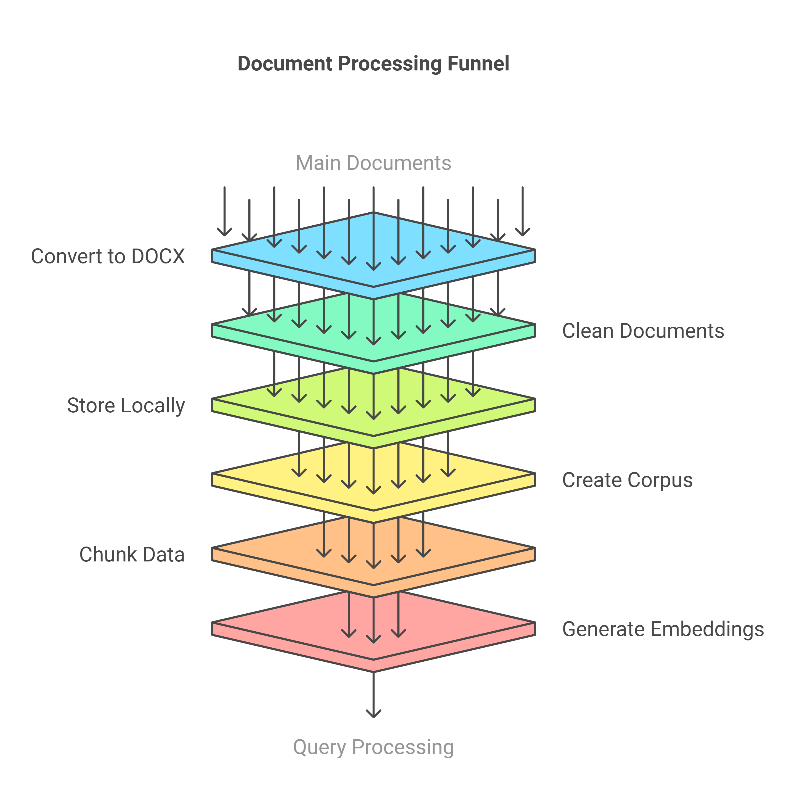

# Aviation RAG Project

AviationRAG is a Retrieval-Augmented Generation system designed for the aviation industry. It processes aviation-related documents, generates embeddings, and provides a query interface for retrieving relevant information.

## Disclaimer

This project, AviationRAG (Retrieval-Augmented Generation for Aviation), is designed as an experimental research tool. It is not intended as the main toll for aviation decision-making processes. The information provided by this system should not be considered a substitute for official aviation documentation, regulations, or expert consultation.

Users should be aware that:

1. The accuracy and completeness of the information cannot be guaranteed.
2. The system's responses are based on the data it has been trained on and may not reflect the most current aviation standards or practices.
3. This tool should not be used for critical aviation-related tasks or decisions.

By using this system, you acknowledge and agree that AviationRAG's creators and contributors are not liable for any consequences resulting from the use or misuse of this tool or the information it provides.

Always refer to official aviation authorities, documentation, and certified professionals for authoritative information and guidance.

## Features

- Document processing and chunking
- Embedding generation using OpenAI's API
- Vector storage in Astra DB
- Similarity search for relevant information retrieval

## Table of Contents

- [Introduction](#introduction)
- [Project Description](#project-description)
- [Project Structure](#project-structure)
- [Installation](#installation)
- [Usage](#usage)
- [Routine Algorithm](#routine-algorithm)
- [Scripts Description](#scripts-description)
- [Contributing](#contributing)
- [License](#license)
- [Dependencies](#dependencies)

## Introduction

The Aviation RAG (Retrieval-Augmented Generation) Project is an innovative initiative designed to address the complex challenges in the aeronautical community and industry. In today's interconnected world, the journey from conceptualization to flight involves a vast network of processes, data, and decision-making that spans across countries and relies heavily on electronic communication.

### The Complexity of Aviation

The aviation industry is characterized by its intricate landscape of components, systems, and regulations. From the initial design phase to manufacturing, assembly, and eventual flight, each step involves substantial amounts of data, information exchange, and critical decision-making. This complexity significantly influences safety outcomes, which are paramount in aviation.

### Safety as a Core Value

In aviation, safety is not merely a set of practices but a fundamental aspect of the industry's culture. It must be integrated into every facet of aviation thinking, from design to operation. As the industry continues to evolve and expand, fostering a robust safety culture becomes increasingly crucial.

### The Data Challenge

With the exponential growth of data, processes, and information in the aviation sector, decision-making has become more complex than ever before. The sheer volume of information that needs to be processed, analyzed, and acted upon presents a significant challenge to industry professionals.

### Leveraging Advanced Technology

Recent advancements in Large Language Models (LLMs) have opened new possibilities for managing and analyzing vast amounts of information. The Aviation RAG Project harnesses these technological breakthroughs to enhance our ability to process, understand, and utilize the wealth of data available in the aviation industry.

### Project Goals

The primary goal of this project is to develop a sophisticated Retrieval-Augmented Generation system that allows users to query a comprehensive aviation corpus in real-time. By combining the power of LLMs with a curated database of aviation knowledge, we aim to provide a tool that can:

1. Quickly retrieve relevant information from a vast corpus of aviation documents
2. Generate accurate and context-aware responses to complex queries
3. Augment decision-making processes with data-driven insights
4. Enhance safety practices by making critical information more accessible
5. Foster a more interconnected and informed aviation community

Through this project, we strive to contribute to the ongoing efforts to make aviation safer, more efficient, and better equipped to handle the challenges of the 21st century.

## Project Description

The Aviation RAG Project is a sophisticated information retrieval and generation system designed for the aviation industry. It combines advanced natural language processing with a comprehensive aviation knowledge base to provide accurate, context-aware responses to complex queries in real-time.

### Overview

This project implements a Retrieval-Augmented Generation (RAG) system, allowing users to query a vast aviation corpus and receive enhanced responses powered by Large Language Models (LLMs). The system excels in quickly retrieving relevant information, generating accurate answers, and augmenting decision-making processes with data-driven insights.

### Key Features

- Real-time querying of an extensive aviation knowledge base
- Context-aware response generation using state-of-the-art LLMs
- Vector similarity search for efficient information retrieval
- Scalable architecture suitable for handling large volumes of data
- User-friendly interface for easy interaction with the system

### Technology Stack

- **LangChain.js**: For embedding generation and RAG pipeline management
- **Vercel**: Deployment and hosting platform
- **Astra DB**: Vector database for storing and querying embeddings
- **OpenAI API**: Provides LLM capabilities for response generation
- **Node.js**: Runtime environment for the application

### RAG System Explanation

Retrieval-Augmented Generation (RAG) combines the power of large language models with a knowledge base
to generate more accurate and contextually relevant responses. In our system:

1. User queries are processed to find relevant information in the aviation corpus.
2. Retrieved information is used to augment the context provided to the LLM.
3. The LLM generates a response based on both its training and the retrieved context.

### System Architecture

The flow starts with the selection of primary documents to be processed, changing documents to
the “DOCX” extension, cleaning the documents, removing tables, figures, headers, and other
features, storing the documents in the data/documents folder, processing the documents, to
create store them as part of aviation_corpus.pkl file. The next step is to process the aviation
corpus into chunks, with chunks the data is processed to create the embeddings for each chunk
and stored in the AstraDB database. The system then moves on to query processing, where user
queries are received and interpreted. Once the query is processed, the system efficiently performs
a vector search in the AstraDB, converting the query into a vector representation.
The vector search swiftly identifies relevant data points that match the user's query
based on similarity measures for quick information retrieval. After identifying relevant
vectors, context retrieval takes place. The system gathers data that provides a comprehensive
understanding of the topic, ensuring that the response generated later is well-informed and
contextually relevant. With the context in hand, the next phase is LLM processing; the large
language model is utilized to analyze the retrieved context and formulate a coherent response.
The LLM leverages its training on vast datasets to understand nuances and generate human-like text,
ensuring that the response is accurate and engaging. Finally, the response generation step takes place.
The processed information and insights from the LLM are synthesized into a clear and concise answer
to the user's query. The response is then formatted and delivered to the user,
completing the query processing cycle.
The complete process is shown below, two Figures.




1. User Input → 2. Query Processing → 3. Vector Search in Astra DB → 4. Context Retrieval → 5. LLM Processing → 6. Response Generation

### Data Sources

Our aviation corpus includes a wide range of documents such as:

- Technical manuals
- Safety regulations
- Aircraft specifications
- Incident reports
- Industry best practices

### Performance Metrics

[If available, add some metrics about response time, accuracy, or other relevant performance indicators]

### Future Enhancements

- Integration with real-time aviation data feeds
- Multi-language support for global accessibility
- Advanced visualization of complex aviation concepts
- Mobile application for on-the-go access

### Implementation Steps

#### 1 - read_documents.py - First script

This script read documents from data/documents The documents shall be in the following formats: "PDF" or "DOCX" the preferable format is "DOCX"
Output = aviation_corpus.pkl file

    ```python
        import os
        import pickle
        import pdfplumber
        import spacy
        import nltk
        from nltk.corpus import stopwords
        from nltk.tokenize import word_tokenize
        from nltk.stem import WordNetLemmatizer
        import csv
        import re
        from docx import Document
        from spellchecker import SpellChecker
        import wordninja
        from sklearn.feature_extraction.text import TfidfVectorizer
        import PyPDF2
        import logging

        # Load spaCy's English model
        nlp = spacy.load('en_core_web_sm')
        nlp.max_length = 2000000  # or any other suitable value
        # Download required NLTK data
        nltk.download('punkt')
        nltk.download('stopwords')
        nltk.download('wordnet')
        # Initialize spellchecker
        spell = SpellChecker()
        # Suppress specific warnings
        import warnings
        warnings.filterwarnings("ignore", message="usetex mode requires TeX.")
        # Global stopwords
        STOP_WORDS = set(stopwords.words('english'))

        # Configure logging
        logging.basicConfig(level=logging.INFO, filename='read_documents.log', format='%(asctime)s - %(levelname)s - %(message)s')

        # Define base directory
        BASE_DIR = r'C:\Users\Aspire5 15 i7 4G2050\ProjectRAG\AviationRAG'

        # Define paths
        TEXT_OUTPUT_DIR = os.path.join(BASE_DIR, 'data', 'processed', 'ProcessedText')
        TEXT_EXPANDED_DIR = os.path.join(BASE_DIR, 'data', 'processed', 'ProcessedTextExpanded')
        PKL_FILENAME = os.path.join(BASE_DIR, 'data', 'raw', 'aviation_corpus.pkl')

        # Ensure directories exist
        for directory in [TEXT_OUTPUT_DIR, TEXT_EXPANDED_DIR, os.path.dirname(PKL_FILENAME)]:
            if not os.path.exists(directory):
                os.makedirs(directory)
                logging.info(f"Created directory: {directory}")
            else:
                logging.info(f"Directory already exists: {directory}")

        # Create custom pipeline component for aviation NER
        @spacy.Language.component("aviation_ner")
        def aviation_ner(doc):
            logging.info(f"Starting aviation_ner for document: {doc[:50]}...")
            patterns = [
                ("AIRCRAFT_MODEL", r"\b[A-Z]-?[0-9]{1,4}\b"),
                ("AIRPORT_CODE", r"\b[A-Z]{3}\b"),
                ("FLIGHT_NUMBER", r"\b[A-Z]{2,3}\s?[0-9]{1,4}\b"),
                ("AIRLINE", r"\b(American Airlines|Delta Air Lines|United Airlines|Southwest Airlines|Air France|Lufthansa|British Airways)\b"),
                ("AVIATION_ORG", r"\b(FAA|EASA|ICAO|IATA)\b"),
            ]

            new_ents = []
            for ent_type, pattern in patterns:
                for match in re.finditer(pattern, doc.text):
                    start, end = match.span()
                        span = doc.char_span(start, end, label=ent_type)
                        if span is not None:
                            # Check for overlap with existing entities
                            if not any(span.start < ent.end and span.end > ent.start for ent in list(doc.ents) + new_ents):
                                new_ents.append(span)
                                logging.debug(f"Added new entity: {span.text} ({ent_type})")
                                
                doc.ents = list(doc.ents) + new_ents
                logging.info(f"Finished aviation_ner. Added {len(new_ents)} new entities.")
                return doc

            # Add the custom component to the pipeline
            nlp.add_pipe("aviation_ner", after="ner")

            def load_abbreviation_dict():
                abbreviation_dict = {}
                try:
                    with open('abbreviations.csv', mode='r') as infile:
                        reader = csv.reader(infile)
                        for rows in reader:
                            if len(rows) < 2:
                                continue
                            abbreviation_dict[rows[0].strip()] = rows[1].strip()
                except FileNotFoundError:
                    print("Error: The file 'abbreviations.csv' was not found.")
                except Exception as e:
                    print(f"An error occurred while loading the abbreviation dictionary: {e}")
                return abbreviation_dict

            def split_connected_words_improved(text):
                words = re.findall(r'\w+|\W+', text)
                split_words = []
                for word in words:
                    if len(word) > 15 and word.isalnum():
                        split_parts = re.findall('[A-Z][a-z]*|[a-z]+|[0-9]+', word)
                        split_words.extend(split_parts)
                    else:
                        split_words.append(word)
                split_words = ' '.join(split_words)
                split_words = ' '.join(wordninja.split(split_words))
                return split_words

            def filter_non_sense_strings(text):
                words = text.split()
                cleaned_words = []
                for word in words:
                    if re.match(r'^[a-zA-Z]+$', word) and len(set(word.lower())) > 3:
                        cleaned_words.append(word)
                return ' '.join(cleaned_words)

            def preprocess_text_with_sentences(text):
                doc = nlp(text)
                sentences = []
                for sent in doc.sents:
                    cleaned_sentence = ' '.join(
                        token.lemma_.lower() for token in sent
                        if token.is_alpha and token.text.lower() not in STOP_WORDS
                    )
                    if cleaned_sentence:
                        sentences.append(cleaned_sentence)
                return ' '.join(sentences)

            def extract_personal_names(text):
                doc = nlp(text)
                return [ent.text for ent in doc.ents if ent.label_ == 'PERSON']

            def extract_entities_and_pos_tags(text):
                doc = nlp(text)
                entities = [(ent.text, ent.label_) for ent in doc.ents]
                pos_tags = [(token.text, token.pos_) for token in doc]
                return entities, pos_tags

            def expand_abbreviations_in_text(text, abbreviation_dict):
                words = text.split()
                expanded_words = []
                for word in words:
                    if word.lower() in abbreviation_dict:
                        expanded_words.append(abbreviation_dict[word.lower()])
                    else:
                        expanded_words.append(word)
                return ' '.join(expanded_words)

            def extract_text_from_pdf_with_pdfplumber(pdf_path):
                try:
                    with pdfplumber.open(pdf_path) as pdf:
                        text = ''.join([page.extract_text() + '\n' for page in pdf.pages])
                        return text
                except Exception as e:
                    print(f"Failed to process PDF {pdf_path}: {e}")
                    return ""

            def extract_keywords(documents, top_n=10):
                texts = [doc['text'] for doc in documents]
                vectorizer = TfidfVectorizer(stop_words='english', max_features=1000)
                tfidf_matrix = vectorizer.fit_transform(texts)
                
                feature_names = vectorizer.get_feature_names_out()
                for idx, doc in enumerate(documents):
                    tfidf_scores = tfidf_matrix[idx].toarray()[0]
                    sorted_indices = tfidf_scores.argsort()[::-1]
                    doc['keywords'] = [feature_names[i] for i in sorted_indices[:top_n]]

            def extract_metadata(file_path):
                metadata = {}
                if file_path.endswith('.pdf'):
                    with open(file_path, 'rb') as file:
                        reader = PyPDF2.PdfReader(file)
                        metadata = reader.metadata
                # Add more file types as needed
                return metadata

            def classify_document(text):
                keywords = {
                    'safety': ['safety', 'hazard', 'risk', 'incident', 'accident','system','hazard','emergency'],
                    'maintenance': ['maintenance', 'repair', 'overhaul', 'inspection'],
                    'operations': ['flight', 'takeoff', 'landing', 'crew', 'pilot','aircraft', 'airplane'],
                    'regulations': ['regulation', 'compliance', 'standard', 'rule', 'law'],
                    'quality': ['quality', 'performance', 'service', 'customer', 'satisfaction','design'],
                }
                
                text_lower = text.lower()
                scores = {category: sum(1 for word in words if word in text_lower) for category, words in keywords.items()}
                return max(scores, key=scores.get)

            def read_documents_from_directory(directory_path, text_output_dir=None, text_expanded_dir=None, existing_documents=None):
                logging.info(f"Starting to read documents from {directory_path}")
                if existing_documents is None:
                    existing_documents = []
                
                existing_files = {doc['filename'] for doc in existing_documents}
                new_documents = []
                abbreviation_dict = load_abbreviation_dict()
                lemmatizer = WordNetLemmatizer()

                for filename in os.listdir(directory_path):
                    logging.info(f"Processing file: {filename}")
                    if filename in existing_files:
                        continue

                    file_path = os.path.join(directory_path, filename)
                    text = ''
                    if filename.endswith(".pdf"):
                        logging.info(f"Extracting text from PDF: {filename}")
                        text = extract_text_from_pdf_with_pdfplumber(file_path)
                    elif filename.endswith(".docx"):
                        logging.info(f"Extracting text from DOCX: {filename}")
                        try:
                            doc = Document(file_path)
                            text = '\n'.join([paragraph.text for paragraph in doc.paragraphs])
                        except Exception as e:
                            logging.error(f"Failed to process DOCX {filename}: {e}")
                            print(f"Failed to process DOCX {filename}: {e}")
                            continue
                    else:
                        logging.warning(f"Skipping unsupported file type: {filename}")
                        continue

                    logging.info(f"Preprocessing text from {filename}")
                    if not text:
                        logging.warning(f"No text extracted from {filename}")
                        continue

                    expanded_text = expand_abbreviations_in_text(text, abbreviation_dict)
                    raw_text = expanded_text
                    expanded_text = split_connected_words_improved(expanded_text)
                    expanded_text = filter_non_sense_strings(expanded_text)
                    preprocessed_text = preprocess_text_with_sentences(expanded_text)
                    personal_names = extract_personal_names(preprocessed_text)
                    entities, pos_tags = extract_entities_and_pos_tags(preprocessed_text)
                    tokens = word_tokenize(preprocessed_text)
                    cleaned_tokens = [token.lower() for token in tokens if token.isalpha() and len(token) > 2]
                    tokens_without_stopwords = [token for token in cleaned_tokens if token not in STOP_WORDS]
                    lemmatized_tokens = [lemmatizer.lemmatize(token) for token in tokens_without_stopwords]

                    if text_expanded_dir:
                        output_file_path = os.path.join(text_expanded_dir, f'{filename}.txt')
                        with open(output_file_path, 'w', encoding='utf-8') as out_file:
                            out_file.write(raw_text)
                        logging.info(f"Expanded text saved to: {output_file_path}")
                        print(f"Expanded text saved to: {output_file_path}")
                        
                    if text_output_dir:
                        output_file_path = os.path.join(text_output_dir, f'{filename}.txt')
                        logging.info(f"Processed text saved to: {output_file_path}")
                        with open(output_file_path, 'w', encoding='utf-8') as out_file:
                            out_file.write(preprocessed_text)
                        print(f"Text saved to: {output_file_path}")

                    logging.info(f"Finished processing all documents in {directory_path}")
                    metadata = extract_metadata(file_path)
                    document_category = classify_document(preprocessed_text)

                    new_documents.append({
                        'filename': filename,
                        'text': preprocessed_text,
                        'tokens': lemmatized_tokens,
                        'personal_names': personal_names,
                        'entities': entities,
                        'pos_tags': pos_tags,
                        'metadata': metadata,
                        'category': document_category
                    })

                return existing_documents + new_documents

            def update_existing_documents(documents):
                for doc in documents:
                    if 'metadata' not in doc:
                        doc['metadata'] = extract_metadata(os.path.join(BASE_DIR, doc['filename']))
                    if 'category' not in doc:
                        doc['category'] = classify_document(doc['text'])
                return documents

            def main():
                documents = None
                if os.path.exists(PKL_FILENAME):
                    with open(PKL_FILENAME, 'rb') as file:
                        documents = pickle.load(file)
                    documents = update_existing_documents(documents)

                if documents is None:
                    print("Reading documents from directory...")
                    documents = read_documents_from_directory(BASE_DIR, TEXT_OUTPUT_DIR, TEXT_EXPANDED_DIR)
                else:
                    print("Appending new documents to the existing list...")
                    documents = read_documents_from_directory(BASE_DIR, TEXT_OUTPUT_DIR, TEXT_EXPANDED_DIR, documents)

                # Apply keyword extraction
                extract_keywords(documents)

                # Save the updated list
                with open(PKL_FILENAME, 'wb') as file:
                    pickle.dump(documents, file)

                print(f"Total documents: {len(documents)}")

            if __name__ == '__main__':
                logging.info("Starting document processing script")
                main()
                logging.info("Document processing script completed")
    ```

#### 2 - aviation_chunk_saver.py

This script creates the chunks from data/raw/aviation_corpus.pkl file
Output = chunks for each document from aviation_corpus.pkl stored in the data/processed/chunked_documents

    ```python

    import os
    import json
    import logging
    import nltk
    from nltk.tokenize import sent_tokenize
    import tiktoken
    import pickle

    # Ensure necessary NLTK data is downloaded
    nltk.download('punkt')

    # Define absolute paths
    base_dir = r'C:\Users\Aspire5 15 i7 4G2050\ProjectRAG\AviationRAG'
    pkl_file = os.path.join(base_dir, 'data', 'raw', 'aviation_corpus.pkl')
        chunk_output_dir = os.path.join(base_dir, 'data', 'processed', 'chunked_documents')

        # Set up logging
        logging.basicConfig(level=logging.INFO, filename='chunking.log',
                            format='%(asctime)s - %(levelname)s - %(message)s')

        # Directory to save chunked JSON files
        if not os.path.exists(chunk_output_dir):
            os.makedirs(chunk_output_dir)

        # Initialize OpenAI tokenizer for accurate token counting
        tokenizer = tiktoken.encoding_for_model("text-embedding-ada-002")

        # Function to count tokens using OpenAI's tokenizer
        def count_tokens(text):
            return len(tokenizer.encode(text))

        # Function to chunk text by sentences and enforce token limits
        def chunk_text_by_sentences(text, max_tokens=500, overlap=50):
            sentences = sent_tokenize(text)  # Tokenize into sentences
            chunks = []
            current_chunk = []
            current_tokens = 0

            for sentence in sentences:
                sentence_token_count = count_tokens(sentence)

                # Check if adding this sentence exceeds the max token limit
                if current_tokens + sentence_token_count > max_tokens:
                    # Save the current chunk only if it's not empty
                    if current_chunk:
                        chunks.append(" ".join(current_chunk))
                    # Start a new chunk with overlap (only if not the first chunk)
                    current_chunk = current_chunk[-overlap:] if overlap and len(chunks) > 0 else []
                    current_tokens = count_tokens(" ".join(current_chunk))

                current_chunk.append(sentence)
                current_tokens += sentence_token_count

            # Add the last chunk if it exists
            if current_chunk:
                chunks.append(" ".join(current_chunk))

            # Validate and split oversized chunks
            return validate_and_split_chunks(chunks, max_tokens)

        # Function to validate and split oversized chunks
        def validate_and_split_chunks(chunks, max_tokens):
            """Ensure all chunks are within the token limit."""
            validated_chunks = []
            for chunk in chunks:
                token_count = count_tokens(chunk)
                if token_count > max_tokens:
                    logging.warning(f"Chunk exceeds token limit: {token_count} tokens. Splitting further.")
                    # Split the chunk into smaller parts
                    words = chunk.split()
                    temp_chunk = []
                    temp_tokens = 0
                    for word in words:
                        word_token_count = count_tokens(word)
                        if temp_tokens + word_token_count > max_tokens:
                            validated_chunks.append(" ".join(temp_chunk))
                            temp_chunk = []
                            temp_tokens = 0
                        temp_chunk.append(word)
                        temp_tokens += word_token_count
                    if temp_chunk:
                        validated_chunks.append(" ".join(temp_chunk))
                else:
                    validated_chunks.append(chunk)
            return validated_chunks

        # Function to process documents and save chunks as JSON
        def save_documents_as_chunks(documents, output_dir, max_tokens=500, overlap=50):
            for doc in documents:
                filename = doc['filename']
                text = doc['text']
                metadata = doc.get('metadata', {})  # Get metadata if it exists, otherwise empty dict
                category = doc.get('category', '')  # Get category if it exists, otherwise empty string

                chunks = chunk_text_by_sentences(text, max_tokens, overlap)
                validated_chunks = validate_and_split_chunks(chunks, max_tokens)

                output_filename = os.path.join(output_dir, f"{os.path.splitext(filename)[0]}_chunks.json")
                
                chunk_data = {
                    "filename": filename,
                    "metadata": metadata,
                    "category": category,
                    "chunks": [
                        {
                            "text": chunk,
                            "tokens": count_tokens(chunk)
                        } for chunk in validated_chunks
                    ]
                }

                with open(output_filename, 'w', encoding='utf-8') as f:
                    json.dump(chunk_data, f, ensure_ascii=False, indent=2)

                logging.info(f"Processed and saved chunks for {filename}")

        # Main routine
        def main():
            # Load your PKL file containing documents
            if not os.path.exists(pkl_file):
                logging.error(f"Error: PKL file '{pkl_file}' not found!")
                return

            try:
                with open(pkl_file, 'rb') as file:
                    documents = pickle.load(file)
                logging.info(f"Loaded {len(documents)} documents.")
            except Exception as e:
                logging.error(f"Failed to load PKL file: {e}")
                return

            # Process and save chunks for all documents
            save_documents_as_chunks(documents, chunk_output_dir)

            logging.info(f"All documents processed. Chunks saved in '{chunk_output_dir}'.")

        if __name__ == '__main__':
            main()
    ```

#### 3 - extract_pkl_to_json.py

This script extract the original aviation_corpus.pkl to json format and store it on the aviation_corpus.json file

    ```python

        import pickle
        import json
        import os

        # Define absolute paths
        base_dir = r'C:\Users\Aspire5 15 i7 4G2050\ProjectRAG\AviationRAG'
        pkl_path = os.path.join(base_dir, 'data', 'raw', 'aviation_corpus.pkl')
        json_path = os.path.join(base_dir, 'data', 'processed', 'aviation_corpus.json')

        # Load the pickle file
        def extract_pkl_to_json(pkl_path, json_path):
            with open(pkl_path, 'rb') as file:
                corpus = pickle.load(file)
            with open(json_path, 'w', encoding='utf-8') as json_file:
                json.dump(corpus, json_file, ensure_ascii=False, indent=4)

        print(f"Data successfully extracted and saved to {json_path}")
    ```

#### 4 - generate_embeddings.js

This script generates the embeddings from chunked_documents
output - embeddings from chunks saved in the data/embeddings

    ```java
        const fs = require('fs');
        const path = require('path');
        const dotenv = require('dotenv');
        const { Configuration, OpenAIApi } = require('openai');

        // Load environment variables
        dotenv.config();

        const configuration = new Configuration({
        apiKey: process.env.OPENAI_API_KEY,
        });
        const openai = new OpenAIApi(configuration);

        // Utility function to add delay
        function delay(ms) {
        return new Promise(resolve => setTimeout(resolve, ms));
        }

        // Function to load existing embeddings
        function loadExistingEmbeddings(outputPath) {
        if (fs.existsSync(outputPath)) {
            const rawData = fs.readFileSync(outputPath, 'utf-8');
            return JSON.parse(rawData);
        }
        return [];
        }

        // Function to check if chunk ID exists
        function isChunkIdExists(existingEmbeddings, chunk_id) {
        return existingEmbeddings.some(embedding => embedding.chunk_id === chunk_id);
        }

        // Function to process a single chunk
        async function processChunk(chunk, filename, index, existingEmbeddings) {
        const chunk_id = `${filename}-${index}`; // Generate chunk ID dynamically

        // Skip if the chunk ID already exists
        if (isChunkIdExists(existingEmbeddings, chunk_id)) {
            console.log(`Skipping duplicate chunk ID: ${chunk_id}`);
            return null;
        }

        let attempts = 0;
        const maxAttempts = 3;

        while (attempts < maxAttempts) {
            try {
            const response = await openai.createEmbedding({
                model: 'text-embedding-ada-002',
                input: chunk.text,
            });

            const embeddingVector = response.data.data[0].embedding;
            console.log(`Generated embedding for chunk ID: ${chunk_id}`);
            return {
                chunk_id: chunk_id,
                filename: filename,
                text: chunk.text,
                tokens: chunk.tokens, // Add tokens count for reference
                embedding: embeddingVector,
            };
            } catch (err) {
            attempts++;
            console.error(`Error generating embedding for chunk ID: ${chunk_id} (Attempt ${attempts})`, err);
            if (attempts >= maxAttempts) {
                console.error(`Failed to generate embedding for chunk ID: ${chunk_id} after ${maxAttempts} attempts`);
                return null;
            }
            await delay(2000); // Wait before retrying
            }
        }
        }

        // Function to process files from the chunked documents directory
        async function processFile(filePath, existingEmbeddings) {
        const rawData = fs.readFileSync(filePath, 'utf-8');
        const chunkedDoc = JSON.parse(rawData);
        const filename = chunkedDoc.filename;
        const category = chunkedDoc.category; // Metadata
        const embeddings = [];

        console.log(`Processing file: ${filename}, Category: ${category}`);
        for (let i = 0; i < chunkedDoc.chunks.length; i++) {
            const chunk = chunkedDoc.chunks[i];
            const result = await processChunk(chunk, filename, i, existingEmbeddings);
            if (result) embeddings.push(result);
            await delay(500); // Delay between processing chunks
        }

        return embeddings;
        }

        // Main function to generate embeddings
        async function generateEmbeddings() {
        try {
            const chunkedDocsPath = path.join(__dirname, '../../data/processed/chunked_documents');
            const outputPath = path.join(__dirname, '../../data/embeddings/aviation_embeddings.json');
            const files = fs.readdirSync(chunkedDocsPath).filter(file => file.endsWith('.json'));

            // Load existing embeddings
            let allEmbeddings = loadExistingEmbeddings(outputPath);

            console.log(`Found ${files.length} files to process.`);
            for (const file of files) {
            const filePath = path.join(chunkedDocsPath, file);
            const embeddings = await processFile(filePath, allEmbeddings);
            allEmbeddings = allEmbeddings.concat(embeddings);
            }

            // Save all embeddings to a JSON file
            await fs.promises.writeFile(outputPath, JSON.stringify(allEmbeddings, null, 2));
            console.log(`Embeddings saved to ${outputPath}`);
        } catch (err) {
            console.error('Error while generating embeddings:', err);
        }
        }

        // Run the function
        generateEmbeddings();
    ```

#### 5 - store_embeddings_astra.js

store the embeddings in the AstraDB: aviation_rag_db/aviation_data/aviation_documents

    ```java
        const cassandra = require('cassandra-driver');
        const fs = require('fs').promises;
        const path = require('path');
        const dotenv = require('dotenv');

        dotenv.config();

        async function insertEmbeddings() {
            const client = new cassandra.Client({
                cloud: { secureConnectBundle: process.env.ASTRA_DB_SECURE_BUNDLE_PATH },
                credentials: {
                    username: process.env.ASTRA_DB_CLIENT_ID,
                    password: process.env.ASTRA_DB_CLIENT_SECRET,
                },
                keyspace: process.env.ASTRA_DB_KEYSPACE,
            });

            try {
                await client.connect();
                console.log('Connected to Astra DB');

                const embeddingsPath = path.join(__dirname, '../../data/embeddings/aviation_embeddings.json');
                const embeddingsData = JSON.parse(await fs.readFile(embeddingsPath, 'utf8'));

                const selectQuery = 'SELECT chunk_id FROM aviation_documents WHERE chunk_id = ?';
                const insertQuery = 'INSERT INTO aviation_documents (chunk_id, filename, text, tokens, embedding) VALUES (?, ?, ?, ?, ?)';

                for (const item of embeddingsData) {
                    // Check if the chunk_id already exists
                    const result = await client.execute(selectQuery, [item.chunk_id], { prepare: true });

                    if (result.rows.length > 0) {
                        console.log(`Skipping chunk_id: ${item.chunk_id} (already exists)`);
                    } else {
                        // Convert the embedding array to a Buffer
                        const embeddingBuffer = Buffer.from(new Float32Array(item.embedding).buffer);

                        // Insert new embedding
                        await client.execute(insertQuery, [
                            item.chunk_id,
                            item.filename,
                            item.text,
                            item.tokens,
                            embeddingBuffer
                        ], { prepare: true });
                        console.log(`Inserted embedding for chunk_id: ${item.chunk_id}`);
                    }
                }

                console.log('All embeddings processed successfully');
            } catch (err) {
                console.error('Error:', err);
            } finally {
                await client.shutdown();
            }
        }

        insertEmbeddings();
    ```

#### Supportive Routines

The following routines were created to:

Manage the flow since from "read" a document and create the chunks to verify the similarities and check the files contents
Check the AstraDB content
Create the AstraDB table
Connect AstraDB database

## Project Structure

    ```python

    AviationRAG/
        |
        |
        |
        |_____.dvc/
        |      |___cache/
        |      |___tmp/
        |      |___.gitignore
        |      |___config
        |
        |_____.git/
        |      |___hooks/
        |      |___info/
        |      |___lfs/
        |      |___logs/
        |      |___objects/
        |      |___refs/
        |      |___COMMIT_EDITMSG
        |      |___config
        |      |___description
        |      |___FETCH_HEAD
        |      |___HEAD
        |      |___INDEX
        |      |___ORIG_HEAD
        |
        |
        |_____config/
        |          |___secure-connect-aviation_rag-db
        |
        |_____data/
        |      |___documents/
        |      |           |_____documents to be processed "PDF" or "DOCX" files
        |      |
        |      |___embeddings/
        |      |            |_______aviation_embeddings.json
        |      |
        |      |___processed/
        |      |           |________chunked_documents/
        |      |           |                        |_______chunked files for each document processed (json)
        |      |           |
        |      |           |________aviation_corpus.json
        |      |           |________aviation_corpus.json.dvc
        |      |
        |      |___processed/ProcessedText/
        |      |                          |______processed texts from PDF and DOCX files (TXT files)
        |      |
        |      |___processed/ProcessedTestExapanded/
        |      |                                  |______texts from PDF and DOCX files (TXT files)
        |      |
        |      |___raw/
        |            |___aviation_corpus.pkl
        |
        |_____logs/
        |        |___aviation_rag_manager.log 
        |
        |
        |_____models/
        |
        |
        |
        |_____node_modules/
        |
        |
        |
        |_____public/
        |          |_____index.html
        |
        |
        |
        |_____src/
        |      |
        |      |___components/
        |      |
        |      |
        |      |___scripts/
        |      |          |______pycache__/
        |      |          |
        |      |          |____js_files/
        |      |          |           |_____js script files tests
        |      |          |
        |      |          |____py_files
        |      |          |           |_____python files test scripts
        |      |
        |      |__________check_astradb.js - check the Astra database
        |      |
        |      |__________check_astradb_content.js
        |      |
        |      |__________connect_astra.js - connect Astra database
        |      |
        |      |__________create_table_astra.js - create the AstraDB table
        |      |
        |      |__________generate_embeddings.js - generate embeddings from chunk files
        |      |
        |      |__________store_embeddings_astra.js - store the embeddings AstraDB
        |      |
        |      |__________test_openai.js - test openai connection
        |      |
        |      |__________aviation_chunk_saver.py - create the chunks from aviation corpus
        |      |
        |      |__________aviation_rag_manager.py - to manage the pipeline throughout the flow
        |      |
        |      |__________aviationrag_interface.py - generate an interface streamlit to check the embeddings similarity
        |      |
        |      |__________check_pkl_content.py - to check the pkl file content
        |      |
        |      |__________config.py - config the data stored folders
        |      |
        |      |__________embeddings_similarity.py - check the embeddings similarities
        |      |
        |      |__________embeddings_similarity_verification - check the embeddings answers
        |      |
        |      |__________extract_pkl_to_json.py - extract files from corpus to json format
        |      |
        |      |__________read_documents.py - create the corpus from documents processed
        |      |
        |      |__________utils/
        |
        |
        |_____.dvcignore
        |
        |_____.env
        |
        |_____.gitattributes
        |
        |_____.gitignore
        |
        |_____chunking.txt
        |
        |_____diary.txt
        |
        |_____package.json
        |
        |_____processed_files.json
        |
        |_____README.md
        |
        |_____update_data.bat
        |
        |_____vercel.json

    ```

## Installation

    ```bash
    # Clone the repository
    git clone https://github.com/yourusername/AviationRAG.git

    # Navigate to the project directory
    cd AviationRAG

    # Install dependencies
    npm install
    ```

## Usage

## Routine Algorithm

-----
Below there is a pseudo-algorithm description

    1.  Preparing documents to be processed
        - Verify type of documents, PDF – TXT
        - Check for figures, tables
        - Check for columns
        - Filter the documents to be processed
        - Choose the documents 
        - Store the documents into the data/documents Folder
    2.  Documents stored in the data/documents Folder
    3.  Run the script read_documents.py
        - Processes the documents to generate the corpus data
        - Create the aviation_corpus.pkl file
        - Storing aviation_corpus in the data/raw Folder
            - Corpus content (dictionary)
                
                {'filename': filename,
                'text': preprocessed_text,
                'tokens': lemmatized_tokens,
                'personal_names': personal_names,
                'entities': entities,
                'pos_tags': pos_tags,
                'metadata': metadata,
                'category': document_category}
                
    4.  Generating the chunks from the aviation_corpus.pkl
        - Run the script aviation_chunk_saver.py
        - Create the chunks for each document processed with read_document.py, stored in the aviation_corpus.pkl
        - Storing the chunks in the data/processed/chunked_documents Folder
    5.  Generating the aviation_corpus.json file
        - Run the script extract_pkl_to_json.py
        - Storing the aviation_corpus.json in the data/processed Folder
    6.  Generate the embeddings
        - Run the script generate_embeddings.js
        - Read the chunks files from data/processed/chunked_documents
        - Processing each new document and generate a embedding
        - Storing the embeddings in the data/embeddings/aviation_embeddings.json
    7.  Storing the embeddings in the AstraDB
        - Run the script store_embeddings_astra.js
        - The embeddings are stored in the AstraDB
    8.
-----

## Scripts Description

## Contributing

## License

## Dependencies

- Node.js
- Python 3.7+
- OpenAI API
- Astra DB
- LangChain
- [List other major dependencies]
