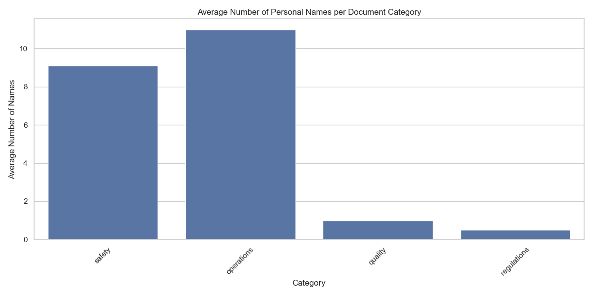
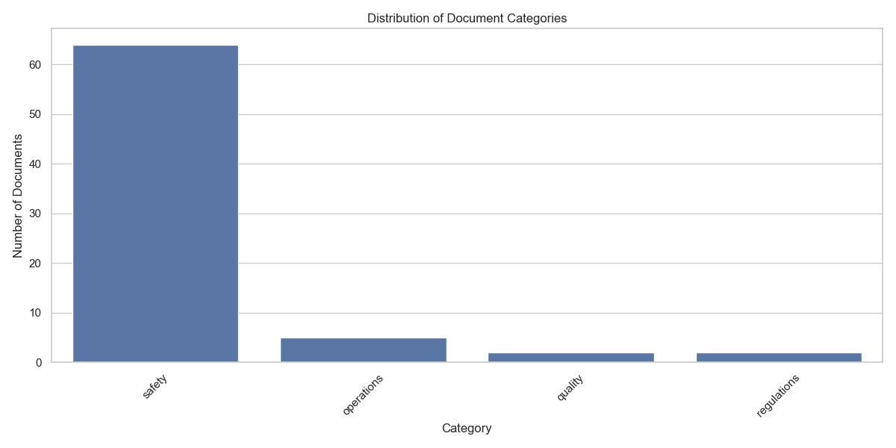
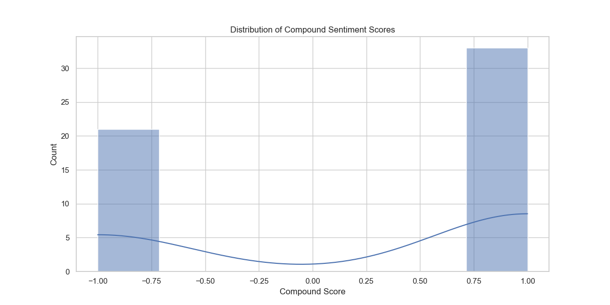
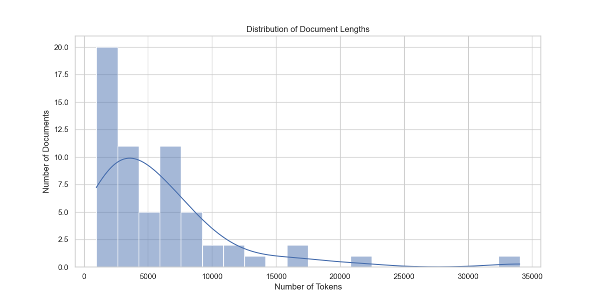
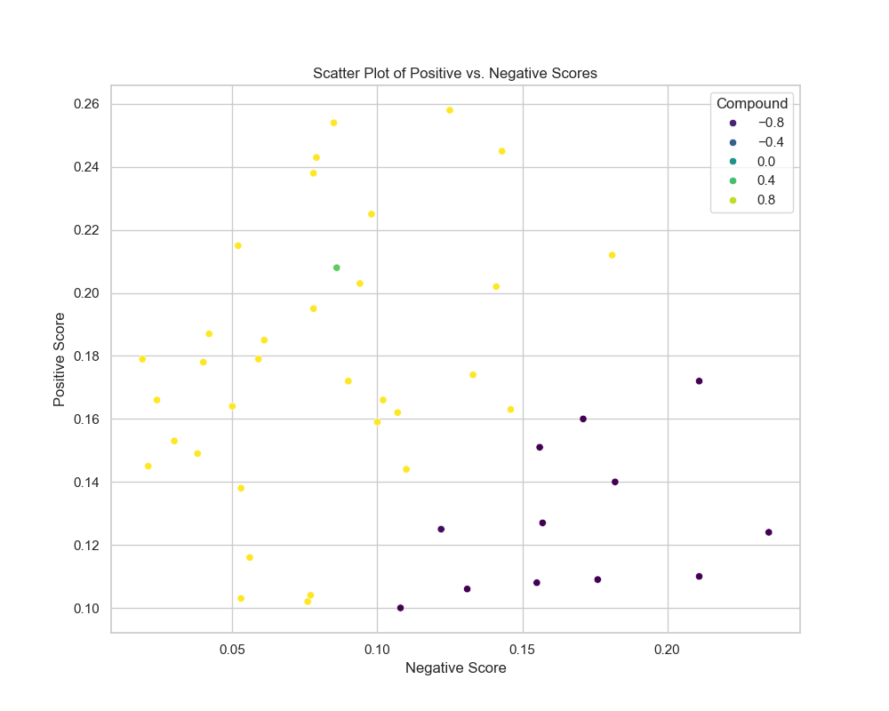

# Aviation RAG Project

AviationRAG is a Retrieval-Augmented Generation system designed for the aviation industry. It processes aviation-related documents, generates embeddings, and provides a query interface for retrieving relevant information.

## Disclaimer

This project, AviationRAG (Retrieval-Augmented Generation for Aviation), is designed as an experimental research tool. It is not intended as the main toll for aviation decision-making processes. The information provided by this system should not be considered a substitute for official aviation documentation, regulations, or expert consultation.

Users should be aware that:

1. The accuracy and completeness of the information cannot be guaranteed.
2. The system's responses are based on the data it has been trained on and may not reflect the most current aviation standards or practices.
3. This tool should not be used for critical aviation-related tasks or decisions.

By using this system, you acknowledge and agree that AviationRAG's creators and contributors are not liable for any consequences resulting from the use or misuse of this tool or the information it provides.

Always refer to official aviation authorities, documentation, and certified professionals for authoritative information and guidance.

## Features

- Document processing and chunking
- Embedding generation using OpenAI's API
- Vector storage in Astra DB
- Similarity search for relevant information retrieval

## Table of Contents

- [Introduction](#introduction)
- [Project Description](#project-description)
- [Project Structure](#project-structure)
- [Installation](#installation)
- [Usage](#usage)
- [Routine Algorithm](#routine-algorithm)
- [Scripts Description](#scripts-description)
- [Contributing](#contributing)
- [License](#license)
- [Dependencies](#dependencies)
- [Metrics](#metrics)

## Introduction

The Aviation RAG (Retrieval-Augmented Generation) Project is an innovative initiative designed to address the complex challenges in the aeronautical community and industry. In today's interconnected world, the journey from conceptualization to flight involves a vast network of processes, data, and decision-making that spans across countries and relies heavily on electronic communication.

### The Complexity of Aviation

The aviation industry is characterized by its intricate landscape of components, systems, and regulations. From the initial design phase to manufacturing, assembly, and eventual flight, each step involves substantial amounts of data, information exchange, and critical decision-making. This complexity significantly influences safety outcomes, which are paramount in aviation.

### Safety as a Core Value

In aviation, safety is not merely a set of practices but a fundamental aspect of the industry's culture. It must be integrated into every facet of aviation thinking, from design to operation. As the industry continues to evolve and expand, fostering a robust safety culture becomes increasingly crucial.

### The Data Challenge

With the exponential growth of data, processes, and information in the aviation sector, decision-making has become more complex than ever before. The sheer volume of information that needs to be processed, analyzed, and acted upon presents a significant challenge to industry professionals.

### Leveraging Advanced Technology

Recent advancements in Large Language Models (LLMs) have opened new possibilities for managing and analyzing vast amounts of information. The Aviation RAG Project harnesses these technological breakthroughs to enhance our ability to process, understand, and utilize the wealth of data available in the aviation industry.

### Project Goals

The primary goal of this project is to develop a sophisticated Retrieval-Augmented Generation system that allows users to query a comprehensive aviation corpus in real-time. By combining the power of LLMs with a curated database of aviation knowledge, we aim to provide a tool that can:

1. Quickly retrieve relevant information from a vast corpus of aviation documents
2. Generate accurate and context-aware responses to complex queries
3. Augment decision-making processes with data-driven insights
4. Enhance safety practices by making critical information more accessible
5. Foster a more interconnected and informed aviation community

Through this project, we strive to contribute to the ongoing efforts to make aviation safer, more efficient, and better equipped to handle the challenges of the 21st century.

## Project Description

The Aviation RAG Project is a sophisticated information retrieval and generation system designed for the aviation industry. It combines advanced natural language processing with a comprehensive aviation knowledge base to provide accurate, context-aware responses to complex queries in real-time.

### Overview

This project implements a Retrieval-Augmented Generation (RAG) system, allowing users to query a vast aviation corpus and receive enhanced responses powered by Large Language Models (LLMs). The system excels in quickly retrieving relevant information, generating accurate answers, and augmenting decision-making processes with data-driven insights.

### Key Features

- Real-time querying of an extensive aviation knowledge base
- Context-aware response generation using state-of-the-art LLMs
- Vector similarity search for efficient information retrieval
- Scalable architecture suitable for handling large volumes of data
- User-friendly interface for easy interaction with the system

### Technology Stack

- **LangChain.js**: For embedding generation and RAG pipeline management
- **Vercel**: Deployment and hosting platform
- **Astra DB**: Vector database for storing and querying embeddings
- **OpenAI API**: Provides LLM capabilities for response generation
- **Node.js**: Runtime environment for the application

### RAG System Explanation

Retrieval-Augmented Generation (RAG) combines the power of large language models with a knowledge base
to generate more accurate and contextually relevant responses. In our system:

1. User queries are processed to find relevant information in the aviation corpus.
2. Retrieved information is used to augment the context provided to the LLM.
3. The LLM generates a response based on both its training and the retrieved context.

### System Architecture

The flow starts with the selection of primary documents to be processed, changing documents to
the “DOCX” extension, cleaning the documents, removing tables, figures, headers, and other
features, storing the documents in the data/documents folder, processing the documents, to
create store them as part of aviation_corpus.pkl file. The next step is to process the aviation
corpus into chunks, with chunks the data is processed to create the embeddings for each chunk
and stored in the AstraDB database. The system then moves on to query processing, where user
queries are received and interpreted. Once the query is processed, the system efficiently performs
a vector search in the AstraDB, converting the query into a vector representation.
The vector search swiftly identifies relevant data points that match the user's query
based on similarity measures for quick information retrieval. After identifying relevant
vectors, context retrieval takes place. The system gathers data that provides a comprehensive
understanding of the topic, ensuring that the response generated later is well-informed and
contextually relevant. With the context in hand, the next phase is LLM processing; the large
language model is utilized to analyze the retrieved context and formulate a coherent response.
The LLM leverages its training on vast datasets to understand nuances and generate human-like text,
ensuring that the response is accurate and engaging. Finally, the response generation step takes place.
The processed information and insights from the LLM are synthesized into a clear and concise answer
to the user's query. The response is then formatted and delivered to the user,
completing the query processing cycle.
The complete process is shown below, two Figures.


1. User Input → 2. Query Processing → 3. Vector Search in Astra DB → 4. Context Retrieval → 5. LLM Processing → 6. Response Generation

### Data Sources

Our aviation corpus includes a wide range of documents such as:

- Technical manuals
- Safety regulations
- Aircraft specifications
- Incident reports
- Industry best practices

### Performance Metrics

[If available, add some metrics about response time, accuracy, or other relevant performance indicators]

### Future Enhancements

- Integration with real-time aviation data feeds
- Multi-language support for global accessibility
- Advanced visualization of complex aviation concepts
- Mobile application for on-the-go access

### Implementation Steps

#### 1 - read_documents.py - First script

This script read documents from data/documents The documents shall be in the following formats: "PDF" or "DOCX" the preferable format is "DOCX"
Output = aviation_corpus.pkl file

```python
        import os
        import pickle
        import pdfplumber
        import spacy
        import nltk
        from nltk.corpus import stopwords
        from nltk.tokenize import word_tokenize
        from nltk.stem import WordNetLemmatizer
        import csv
        import re
        from docx import Document
        from spellchecker import SpellChecker
        import wordninja
        from sklearn.feature_extraction.text import TfidfVectorizer
        import PyPDF2
        import logging

        # Load spaCy's English model
        nlp = spacy.load('en_core_web_sm')
        nlp.max_length = 2000000  # or any other suitable value
        # Download required NLTK data
        nltk.download('punkt')
        nltk.download('stopwords')
        nltk.download('wordnet')
        # Initialize spellchecker
        spell = SpellChecker()
        # Suppress specific warnings
        import warnings
        warnings.filterwarnings("ignore", message="usetex mode requires TeX.")
        # Global stopwords
        STOP_WORDS = set(stopwords.words('english'))

        # Configure logging
        logging.basicConfig(level=logging.INFO, filename='read_documents.log', format='%(asctime)s - %(levelname)s - %(message)s')

        # Define base directory
        BASE_DIR = r'C:\Users\Aspire5 15 i7 4G2050\ProjectRAG\AviationRAG'

        # Define paths
        TEXT_OUTPUT_DIR = os.path.join(BASE_DIR, 'data', 'processed', 'ProcessedText')
        TEXT_EXPANDED_DIR = os.path.join(BASE_DIR, 'data', 'processed', 'ProcessedTextExpanded')
        PKL_FILENAME = os.path.join(BASE_DIR, 'data', 'raw', 'aviation_corpus.pkl')

        # Ensure directories exist
        for directory in [TEXT_OUTPUT_DIR, TEXT_EXPANDED_DIR, os.path.dirname(PKL_FILENAME)]:
            if not os.path.exists(directory):
                os.makedirs(directory)
                logging.info(f"Created directory: {directory}")
            else:
                logging.info(f"Directory already exists: {directory}")

        # Create custom pipeline component for aviation NER
        @spacy.Language.component("aviation_ner")
        def aviation_ner(doc):
            logging.info(f"Starting aviation_ner for document: {doc[:50]}...")
            patterns = [
                ("AIRCRAFT_MODEL", r"\b[A-Z]-?[0-9]{1,4}\b"),
                ("AIRPORT_CODE", r"\b[A-Z]{3}\b"),
                ("FLIGHT_NUMBER", r"\b[A-Z]{2,3}\s?[0-9]{1,4}\b"),
                ("AIRLINE", r"\b(American Airlines|Delta Air Lines|United Airlines|Southwest Airlines|Air France|Lufthansa|British Airways)\b"),
                ("AVIATION_ORG", r"\b(FAA|EASA|ICAO|IATA)\b"),
            ]

            new_ents = []
            for ent_type, pattern in patterns:
                for match in re.finditer(pattern, doc.text):
                    start, end = match.span()
                        span = doc.char_span(start, end, label=ent_type)
                        if span is not None:
                            # Check for overlap with existing entities
                            if not any(span.start < ent.end and span.end > ent.start for ent in list(doc.ents) + new_ents):
                                new_ents.append(span)
                                logging.debug(f"Added new entity: {span.text} ({ent_type})")
                                
                doc.ents = list(doc.ents) + new_ents
                logging.info(f"Finished aviation_ner. Added {len(new_ents)} new entities.")
                return doc

            # Add the custom component to the pipeline
            nlp.add_pipe("aviation_ner", after="ner")

            def load_abbreviation_dict():
                abbreviation_dict = {}
                try:
                    with open('abbreviations.csv', mode='r') as infile:
                        reader = csv.reader(infile)
                        for rows in reader:
                            if len(rows) < 2:
                                continue
                            abbreviation_dict[rows[0].strip()] = rows[1].strip()
                except FileNotFoundError:
                    print("Error: The file 'abbreviations.csv' was not found.")
                except Exception as e:
                    print(f"An error occurred while loading the abbreviation dictionary: {e}")
                return abbreviation_dict

            def split_connected_words_improved(text):
                words = re.findall(r'\w+|\W+', text)
                split_words = []
                for word in words:
                    if len(word) > 15 and word.isalnum():
                        split_parts = re.findall('[A-Z][a-z]*|[a-z]+|[0-9]+', word)
                        split_words.extend(split_parts)
                    else:
                        split_words.append(word)
                split_words = ' '.join(split_words)
                split_words = ' '.join(wordninja.split(split_words))
                return split_words

            def filter_non_sense_strings(text):
                words = text.split()
                cleaned_words = []
                for word in words:
                    if re.match(r'^[a-zA-Z]+$', word) and len(set(word.lower())) > 3:
                        cleaned_words.append(word)
                return ' '.join(cleaned_words)

            def preprocess_text_with_sentences(text):
                doc = nlp(text)
                sentences = []
                for sent in doc.sents:
                    cleaned_sentence = ' '.join(
                        token.lemma_.lower() for token in sent
                        if token.is_alpha and token.text.lower() not in STOP_WORDS
                    )
                    if cleaned_sentence:
                        sentences.append(cleaned_sentence)
                return ' '.join(sentences)

            def extract_personal_names(text):
                doc = nlp(text)
                return [ent.text for ent in doc.ents if ent.label_ == 'PERSON']

            def extract_entities_and_pos_tags(text):
                doc = nlp(text)
                entities = [(ent.text, ent.label_) for ent in doc.ents]
                pos_tags = [(token.text, token.pos_) for token in doc]
                return entities, pos_tags

            def expand_abbreviations_in_text(text, abbreviation_dict):
                words = text.split()
                expanded_words = []
                for word in words:
                    if word.lower() in abbreviation_dict:
                        expanded_words.append(abbreviation_dict[word.lower()])
                    else:
                        expanded_words.append(word)
                return ' '.join(expanded_words)

            def extract_text_from_pdf_with_pdfplumber(pdf_path):
                try:
                    with pdfplumber.open(pdf_path) as pdf:
                        text = ''.join([page.extract_text() + '\n' for page in pdf.pages])
                        return text
                except Exception as e:
                    print(f"Failed to process PDF {pdf_path}: {e}")
                    return ""

            def extract_keywords(documents, top_n=10):
                texts = [doc['text'] for doc in documents]
                vectorizer = TfidfVectorizer(stop_words='english', max_features=1000)
                tfidf_matrix = vectorizer.fit_transform(texts)
                
                feature_names = vectorizer.get_feature_names_out()
                for idx, doc in enumerate(documents):
                    tfidf_scores = tfidf_matrix[idx].toarray()[0]
                    sorted_indices = tfidf_scores.argsort()[::-1]
                    doc['keywords'] = [feature_names[i] for i in sorted_indices[:top_n]]

            def extract_metadata(file_path):
                metadata = {}
                if file_path.endswith('.pdf'):
                    with open(file_path, 'rb') as file:
                        reader = PyPDF2.PdfReader(file)
                        metadata = reader.metadata
                # Add more file types as needed
                return metadata

            def classify_document(text):
                keywords = {
                    'safety': ['safety', 'hazard', 'risk', 'incident', 'accident','system','hazard','emergency'],
                    'maintenance': ['maintenance', 'repair', 'overhaul', 'inspection'],
                    'operations': ['flight', 'takeoff', 'landing', 'crew', 'pilot','aircraft', 'airplane'],
                    'regulations': ['regulation', 'compliance', 'standard', 'rule', 'law'],
                    'quality': ['quality', 'performance', 'service', 'customer', 'satisfaction','design'],
                }
                
                text_lower = text.lower()
                scores = {category: sum(1 for word in words if word in text_lower) for category, words in keywords.items()}
                return max(scores, key=scores.get)

            def read_documents_from_directory(directory_path, text_output_dir=None, text_expanded_dir=None, existing_documents=None):
                logging.info(f"Starting to read documents from {directory_path}")
                if existing_documents is None:
                    existing_documents = []
                
                existing_files = {doc['filename'] for doc in existing_documents}
                new_documents = []
                abbreviation_dict = load_abbreviation_dict()
                lemmatizer = WordNetLemmatizer()

                for filename in os.listdir(directory_path):
                    logging.info(f"Processing file: {filename}")
                    if filename in existing_files:
                        continue

                    file_path = os.path.join(directory_path, filename)
                    text = ''
                    if filename.endswith(".pdf"):
                        logging.info(f"Extracting text from PDF: {filename}")
                        text = extract_text_from_pdf_with_pdfplumber(file_path)
                    elif filename.endswith(".docx"):
                        logging.info(f"Extracting text from DOCX: {filename}")
                        try:
                            doc = Document(file_path)
                            text = '\n'.join([paragraph.text for paragraph in doc.paragraphs])
                        except Exception as e:
                            logging.error(f"Failed to process DOCX {filename}: {e}")
                            print(f"Failed to process DOCX {filename}: {e}")
                            continue
                    else:
                        logging.warning(f"Skipping unsupported file type: {filename}")
                        continue

                    logging.info(f"Preprocessing text from {filename}")
                    if not text:
                        logging.warning(f"No text extracted from {filename}")
                        continue

                    expanded_text = expand_abbreviations_in_text(text, abbreviation_dict)
                    raw_text = expanded_text
                    expanded_text = split_connected_words_improved(expanded_text)
                    expanded_text = filter_non_sense_strings(expanded_text)
                    preprocessed_text = preprocess_text_with_sentences(expanded_text)
                    personal_names = extract_personal_names(preprocessed_text)
                    entities, pos_tags = extract_entities_and_pos_tags(preprocessed_text)
                    tokens = word_tokenize(preprocessed_text)
                    cleaned_tokens = [token.lower() for token in tokens if token.isalpha() and len(token) > 2]
                    tokens_without_stopwords = [token for token in cleaned_tokens if token not in STOP_WORDS]
                    lemmatized_tokens = [lemmatizer.lemmatize(token) for token in tokens_without_stopwords]

                    if text_expanded_dir:
                        output_file_path = os.path.join(text_expanded_dir, f'{filename}.txt')
                        with open(output_file_path, 'w', encoding='utf-8') as out_file:
                            out_file.write(raw_text)
                        logging.info(f"Expanded text saved to: {output_file_path}")
                        print(f"Expanded text saved to: {output_file_path}")
                        
                    if text_output_dir:
                        output_file_path = os.path.join(text_output_dir, f'{filename}.txt')
                        logging.info(f"Processed text saved to: {output_file_path}")
                        with open(output_file_path, 'w', encoding='utf-8') as out_file:
                            out_file.write(preprocessed_text)
                        print(f"Text saved to: {output_file_path}")

                    logging.info(f"Finished processing all documents in {directory_path}")
                    metadata = extract_metadata(file_path)
                    document_category = classify_document(preprocessed_text)

                    new_documents.append({
                        'filename': filename,
                        'text': preprocessed_text,
                        'tokens': lemmatized_tokens,
                        'personal_names': personal_names,
                        'entities': entities,
                        'pos_tags': pos_tags,
                        'metadata': metadata,
                        'category': document_category
                    })

                return existing_documents + new_documents

            def update_existing_documents(documents):
                for doc in documents:
                    if 'metadata' not in doc:
                        doc['metadata'] = extract_metadata(os.path.join(BASE_DIR, doc['filename']))
                    if 'category' not in doc:
                        doc['category'] = classify_document(doc['text'])
                return documents

            def main():
                documents = None
                if os.path.exists(PKL_FILENAME):
                    with open(PKL_FILENAME, 'rb') as file:
                        documents = pickle.load(file)
                    documents = update_existing_documents(documents)

                if documents is None:
                    print("Reading documents from directory...")
                    documents = read_documents_from_directory(BASE_DIR, TEXT_OUTPUT_DIR, TEXT_EXPANDED_DIR)
                else:
                    print("Appending new documents to the existing list...")
                    documents = read_documents_from_directory(BASE_DIR, TEXT_OUTPUT_DIR, TEXT_EXPANDED_DIR, documents)

                # Apply keyword extraction
                extract_keywords(documents)

                # Save the updated list
                with open(PKL_FILENAME, 'wb') as file:
                    pickle.dump(documents, file)

                print(f"Total documents: {len(documents)}")

            if __name__ == '__main__':
                logging.info("Starting document processing script")
                main()
                logging.info("Document processing script completed")
```

#### 2 - aviation_chunk_saver.py

This script creates the chunks from data/raw/aviation_corpus.pkl file
Output = chunks for each document from aviation_corpus.pkl stored in the data/processed/chunked_documents

```python

    import os
    import json
    import logging
    import nltk
    from nltk.tokenize import sent_tokenize
    import tiktoken
    import pickle

    # Ensure necessary NLTK data is downloaded
    nltk.download('punkt')

    # Define absolute paths
    base_dir = r'C:\Users\Aspire5 15 i7 4G2050\ProjectRAG\AviationRAG'
    pkl_file = os.path.join(base_dir, 'data', 'raw', 'aviation_corpus.pkl')
        chunk_output_dir = os.path.join(base_dir, 'data', 'processed', 'chunked_documents')

        # Set up logging
        logging.basicConfig(level=logging.INFO, filename='chunking.log',
                            format='%(asctime)s - %(levelname)s - %(message)s')

        # Directory to save chunked JSON files
        if not os.path.exists(chunk_output_dir):
            os.makedirs(chunk_output_dir)

        # Initialize OpenAI tokenizer for accurate token counting
        tokenizer = tiktoken.encoding_for_model("text-embedding-ada-002")

        # Function to count tokens using OpenAI's tokenizer
        def count_tokens(text):
            return len(tokenizer.encode(text))

        # Function to chunk text by sentences and enforce token limits
        def chunk_text_by_sentences(text, max_tokens=500, overlap=50):
            sentences = sent_tokenize(text)  # Tokenize into sentences
            chunks = []
            current_chunk = []
            current_tokens = 0

            for sentence in sentences:
                sentence_token_count = count_tokens(sentence)

                # Check if adding this sentence exceeds the max token limit
                if current_tokens + sentence_token_count > max_tokens:
                    # Save the current chunk only if it's not empty
                    if current_chunk:
                        chunks.append(" ".join(current_chunk))
                    # Start a new chunk with overlap (only if not the first chunk)
                    current_chunk = current_chunk[-overlap:] if overlap and len(chunks) > 0 else []
                    current_tokens = count_tokens(" ".join(current_chunk))

                current_chunk.append(sentence)
                current_tokens += sentence_token_count

            # Add the last chunk if it exists
            if current_chunk:
                chunks.append(" ".join(current_chunk))

            # Validate and split oversized chunks
            return validate_and_split_chunks(chunks, max_tokens)

        # Function to validate and split oversized chunks
        def validate_and_split_chunks(chunks, max_tokens):
            """Ensure all chunks are within the token limit."""
            validated_chunks = []
            for chunk in chunks:
                token_count = count_tokens(chunk)
                if token_count > max_tokens:
                    logging.warning(f"Chunk exceeds token limit: {token_count} tokens. Splitting further.")
                    # Split the chunk into smaller parts
                    words = chunk.split()
                    temp_chunk = []
                    temp_tokens = 0
                    for word in words:
                        word_token_count = count_tokens(word)
                        if temp_tokens + word_token_count > max_tokens:
                            validated_chunks.append(" ".join(temp_chunk))
                            temp_chunk = []
                            temp_tokens = 0
                        temp_chunk.append(word)
                        temp_tokens += word_token_count
                    if temp_chunk:
                        validated_chunks.append(" ".join(temp_chunk))
                else:
                    validated_chunks.append(chunk)
            return validated_chunks

        # Function to process documents and save chunks as JSON
        def save_documents_as_chunks(documents, output_dir, max_tokens=500, overlap=50):
            for doc in documents:
                filename = doc['filename']
                text = doc['text']
                metadata = doc.get('metadata', {})  # Get metadata if it exists, otherwise empty dict
                category = doc.get('category', '')  # Get category if it exists, otherwise empty string

                chunks = chunk_text_by_sentences(text, max_tokens, overlap)
                validated_chunks = validate_and_split_chunks(chunks, max_tokens)

                output_filename = os.path.join(output_dir, f"{os.path.splitext(filename)[0]}_chunks.json")
                
                chunk_data = {
                    "filename": filename,
                    "metadata": metadata,
                    "category": category,
                    "chunks": [
                        {
                            "text": chunk,
                            "tokens": count_tokens(chunk)
                        } for chunk in validated_chunks
                    ]
                }

                with open(output_filename, 'w', encoding='utf-8') as f:
                    json.dump(chunk_data, f, ensure_ascii=False, indent=2)

                logging.info(f"Processed and saved chunks for {filename}")

        # Main routine
        def main():
            # Load your PKL file containing documents
            if not os.path.exists(pkl_file):
                logging.error(f"Error: PKL file '{pkl_file}' not found!")
                return

            try:
                with open(pkl_file, 'rb') as file:
                    documents = pickle.load(file)
                logging.info(f"Loaded {len(documents)} documents.")
            except Exception as e:
                logging.error(f"Failed to load PKL file: {e}")
                return

            # Process and save chunks for all documents
            save_documents_as_chunks(documents, chunk_output_dir)

            logging.info(f"All documents processed. Chunks saved in '{chunk_output_dir}'.")

        if __name__ == '__main__':
            main()
```

#### 3 - extract_pkl_to_json.py

This script extract the original aviation_corpus.pkl to json format and store it on the aviation_corpus.json file

```python

        import pickle
        import json
        import os

        # Define absolute paths
        base_dir = r'C:\Users\Aspire5 15 i7 4G2050\ProjectRAG\AviationRAG'
        pkl_path = os.path.join(base_dir, 'data', 'raw', 'aviation_corpus.pkl')
        json_path = os.path.join(base_dir, 'data', 'processed', 'aviation_corpus.json')

        # Load the pickle file
        def extract_pkl_to_json(pkl_path, json_path):
            with open(pkl_path, 'rb') as file:
                corpus = pickle.load(file)
            with open(json_path, 'w', encoding='utf-8') as json_file:
                json.dump(corpus, json_file, ensure_ascii=False, indent=4)

        print(f"Data successfully extracted and saved to {json_path}")
```

#### 4 - generate_embeddings.js

This script generates the embeddings from chunked_documents
output - embeddings from chunks saved in the data/embeddings

```java
        const fs = require('fs');
        const path = require('path');
        const dotenv = require('dotenv');
        const { Configuration, OpenAIApi } = require('openai');

        // Load environment variables
        dotenv.config();

        const configuration = new Configuration({
        apiKey: process.env.OPENAI_API_KEY,
        });
        const openai = new OpenAIApi(configuration);

        // Utility function to add delay
        function delay(ms) {
        return new Promise(resolve => setTimeout(resolve, ms));
        }

        // Function to load existing embeddings
        function loadExistingEmbeddings(outputPath) {
        if (fs.existsSync(outputPath)) {
            const rawData = fs.readFileSync(outputPath, 'utf-8');
            return JSON.parse(rawData);
        }
        return [];
        }

        // Function to check if chunk ID exists
        function isChunkIdExists(existingEmbeddings, chunk_id) {
        return existingEmbeddings.some(embedding => embedding.chunk_id === chunk_id);
        }

        // Function to process a single chunk
        async function processChunk(chunk, filename, index, existingEmbeddings) {
        const chunk_id = `${filename}-${index}`; // Generate chunk ID dynamically

        // Skip if the chunk ID already exists
        if (isChunkIdExists(existingEmbeddings, chunk_id)) {
            console.log(`Skipping duplicate chunk ID: ${chunk_id}`);
            return null;
        }

        let attempts = 0;
        const maxAttempts = 3;

        while (attempts < maxAttempts) {
            try {
            const response = await openai.createEmbedding({
                model: 'text-embedding-ada-002',
                input: chunk.text,
            });

            const embeddingVector = response.data.data[0].embedding;
            console.log(`Generated embedding for chunk ID: ${chunk_id}`);
            return {
                chunk_id: chunk_id,
                filename: filename,
                text: chunk.text,
                tokens: chunk.tokens, // Add tokens count for reference
                embedding: embeddingVector,
            };
            } catch (err) {
            attempts++;
            console.error(`Error generating embedding for chunk ID: ${chunk_id} (Attempt ${attempts})`, err);
            if (attempts >= maxAttempts) {
                console.error(`Failed to generate embedding for chunk ID: ${chunk_id} after ${maxAttempts} attempts`);
                return null;
            }
            await delay(2000); // Wait before retrying
            }
        }
        }

        // Function to process files from the chunked documents directory
        async function processFile(filePath, existingEmbeddings) {
        const rawData = fs.readFileSync(filePath, 'utf-8');
        const chunkedDoc = JSON.parse(rawData);
        const filename = chunkedDoc.filename;
        const category = chunkedDoc.category; // Metadata
        const embeddings = [];

        console.log(`Processing file: ${filename}, Category: ${category}`);
        for (let i = 0; i < chunkedDoc.chunks.length; i++) {
            const chunk = chunkedDoc.chunks[i];
            const result = await processChunk(chunk, filename, i, existingEmbeddings);
            if (result) embeddings.push(result);
            await delay(500); // Delay between processing chunks
        }

        return embeddings;
        }

        // Main function to generate embeddings
        async function generateEmbeddings() {
        try {
            const chunkedDocsPath = path.join(__dirname, '../../data/processed/chunked_documents');
            const outputPath = path.join(__dirname, '../../data/embeddings/aviation_embeddings.json');
            const files = fs.readdirSync(chunkedDocsPath).filter(file => file.endsWith('.json'));

            // Load existing embeddings
            let allEmbeddings = loadExistingEmbeddings(outputPath);

            console.log(`Found ${files.length} files to process.`);
            for (const file of files) {
            const filePath = path.join(chunkedDocsPath, file);
            const embeddings = await processFile(filePath, allEmbeddings);
            allEmbeddings = allEmbeddings.concat(embeddings);
            }

            // Save all embeddings to a JSON file
            await fs.promises.writeFile(outputPath, JSON.stringify(allEmbeddings, null, 2));
            console.log(`Embeddings saved to ${outputPath}`);
        } catch (err) {
            console.error('Error while generating embeddings:', err);
        }
        }

        // Run the function
        generateEmbeddings();
```

#### 5 - store_embeddings_astra.js

store the embeddings in the AstraDB: aviation_rag_db/aviation_data/aviation_documents

```java
        const cassandra = require('cassandra-driver');
        const fs = require('fs').promises;
        const path = require('path');
        const dotenv = require('dotenv');

        dotenv.config();

        async function insertEmbeddings() {
            const client = new cassandra.Client({
                cloud: { secureConnectBundle: process.env.ASTRA_DB_SECURE_BUNDLE_PATH },
                credentials: {
                    username: process.env.ASTRA_DB_CLIENT_ID,
                    password: process.env.ASTRA_DB_CLIENT_SECRET,
                },
                keyspace: process.env.ASTRA_DB_KEYSPACE,
            });

            try {
                await client.connect();
                console.log('Connected to Astra DB');

                const embeddingsPath = path.join(__dirname, '../../data/embeddings/aviation_embeddings.json');
                const embeddingsData = JSON.parse(await fs.readFile(embeddingsPath, 'utf8'));

                const selectQuery = 'SELECT chunk_id FROM aviation_documents WHERE chunk_id = ?';
                const insertQuery = 'INSERT INTO aviation_documents (chunk_id, filename, text, tokens, embedding) VALUES (?, ?, ?, ?, ?)';

                for (const item of embeddingsData) {
                    // Check if the chunk_id already exists
                    const result = await client.execute(selectQuery, [item.chunk_id], { prepare: true });

                    if (result.rows.length > 0) {
                        console.log(`Skipping chunk_id: ${item.chunk_id} (already exists)`);
                    } else {
                        // Convert the embedding array to a Buffer
                        const embeddingBuffer = Buffer.from(new Float32Array(item.embedding).buffer);

                        // Insert new embedding
                        await client.execute(insertQuery, [
                            item.chunk_id,
                            item.filename,
                            item.text,
                            item.tokens,
                            embeddingBuffer
                        ], { prepare: true });
                        console.log(`Inserted embedding for chunk_id: ${item.chunk_id}`);
                    }
                }

                console.log('All embeddings processed successfully');
            } catch (err) {
                console.error('Error:', err);
            } finally {
                await client.shutdown();
            }
        }

        insertEmbeddings();
 ```

#### Supportive Routines

-----
The following routines were created to:

.Manage the flow since from "read" a document and create the chunks to verify the similarities and check the files contents

.Check the AstraDB content

.Create the AstraDB table

.Connect AstraDB database

.Store the embedding into the AstraDB

. User Interface

##### config.py

```python
    
    from pathlib import Path

    BASE_DIR = Path(__file__).resolve().parent
    PROCESSED_DIR = BASE_DIR / "data" / "processed"
    CHUNKED_DIR = PROCESSED_DIR / "chunked_documents"
    TEXT_OUTPUT_DIR = PROCESSED_DIR / "ProcessedText"
    TEXT_EXPANDED_DIR = PROCESSED_DIR / "ProcessedTextExpanded"
    PKL_FILENAME = BASE_DIR / "data" / "raw" / "aviation_corpus.pkl"
    EMBEDDINGS_FILE = BASE_DIR / "data" / "embeddings" / "aviation_embeddings.json"

```

##### aviationrag_interface.py

```python

    import streamlit as st
    import json
    import pandas as pd
    from openai import OpenAI
    import os
    from dotenv import load_dotenv

    load_dotenv()

    # Set up OpenAI API key
    client = OpenAI(api_key=os.getenv("OPENAI_API_KEY"))

    # Load embeddings
    @st.cache_data(ttl=3600, show_spinner=False)
    def load_embeddings(embeddings_file):
        with open(embeddings_file, "r", encoding="utf-8") as file:
            return json.load(file)

    def get_query_embedding(query, model="text-embedding-ada-002"):
        """Generate embedding for user query."""
        response = client.embeddings.create(input=[query], model=model)
        return response.data[0].embedding

    def cosine_similarity(vec1, vec2):
        """Compute cosine similarity between two vectors."""
        return sum(a * b for a, b in zip(vec1, vec2)) / (sum(a ** 2 for a in vec1) ** 0.5 * sum(b ** 2 for b in vec2) ** 0.5)

    # Retrieve top results
    def retrieve_top_chunks(query_embedding, embeddings_data, top_n=5):
        results = []
        for chunk in embeddings_data:
            similarity = cosine_similarity(query_embedding, chunk["embedding"])
            results.append({
                "Filename": chunk["filename"],
                "Chunk ID": chunk["chunk_id"],
                "Similarity": similarity,
                "Text": chunk["text"]
            })
        return sorted(results, key=lambda x: x["Similarity"], reverse=True)[:top_n]

    # Streamlit UI
    def main():
        st.title("AviationRAG: Query Interface")
        
        # Load embeddings
        embeddings_file = "data/embeddings/aviation_embeddings.json"
        embeddings_data = load_embeddings(embeddings_file)
        
        # User input
        query = st.text_input("Enter your query:", "")
        
        if st.button("Submit Query"):
            if query:
                st.info("Generating query embedding...")
                query_embedding = get_query_embedding(query)
                
                st.info("Retrieving top chunks...")
                top_chunks = retrieve_top_chunks(query_embedding, embeddings_data)
                
                # Display results
                st.subheader("Top Results:")
                for chunk in top_chunks:
                    st.markdown(f"**Filename:** {chunk['Filename']}")
                    st.markdown(f"**Chunk ID:** {chunk['Chunk ID']}")
                    st.markdown(f"**Similarity:** {chunk['Similarity']:.4f}")
                    st.markdown(f"**Text:** {chunk['Text']}")
                    st.markdown("---")
                    
                st.success("Response generated successfully!")
            else:
                st.warning("Please enter a query.")

    if __name__ == "__main__":
        main()

```

##### check_pkl_content.py

```python

    import pickle
    import os
    from pathlib import Path

    def check_pkl_content():
        # Get the project root directory
        project_root = Path(__file__).resolve().parent.parent.parent
        
        # Define the path to the aviation_corpus.pkl file
        pkl_path = project_root / 'data' / 'raw' / 'aviation_corpus.pkl'
        
        if not pkl_path.exists():
            print(f"Error: The file {pkl_path} does not exist.")
            return
        
        try:
            with open(pkl_path, 'rb') as file:
                corpus = pickle.load(file)
            
            print(f"Successfully loaded aviation_corpus.pkl")
            print(f"Number of documents: {len(corpus)}")
            
            # Print details of the first few documents
            for i, doc in enumerate(corpus[:]):
                print(f"\nDocument {i + 1}:")
                print(f"Filename: {doc.get('filename', 'N/A')}")
                print(f"Text length: {len(doc.get('text', ''))}")
                print(f"Number of tokens: {len(doc.get('tokens', []))}")
                print(f"Number of entities: {len(doc.get('entities', []))}")
                print(f"Number of personal names: {len(doc.get('personal_names', []))}")
                print(f"Category: {doc.get('category', 'N/A')}")
                print(f"Number of Pos-Tags: {len(doc.get('pos_tags', []))}")
        
        except Exception as e:
            print(f"An error occurred while reading the file: {e}")

    if __name__ == "__main__":
        check_pkl_content()
```

##### embeddings_similarity.py

```python

    import json
    import os
    from sklearn.metrics.pairwise import cosine_similarity
    import numpy as np
    from openai import OpenAI
    from dotenv import load_dotenv

    # Load environment variables
    load_dotenv()

    # Set up the OpenAI API key
    client = OpenAI(api_key=os.getenv("OPENAI_API_KEY"))

    def get_embedding(text, model="text-embedding-ada-002"):
        """Generate embedding using OpenAI's updated client."""
        try:
            response = client.embeddings.create(
                input=[text],  # OpenAI API requires input as a single string or list
                model=model
            )
            # Extract the embedding
            return response.data[0].embedding
        except Exception as e:
            print(f"Error generating embedding: {e}")
            return None

    # Load embeddings from a JSON file
    def load_embeddings(file_path):
        """
        Load embeddings from a JSON file.

        Args:
            file_path (str): Path to the JSON file containing embeddings.

        Returns:
            list: List of embeddings with metadata.
        """
        if not os.path.exists(file_path):
            raise FileNotFoundError(f"File not found: {file_path}")

        with open(file_path, 'r', encoding='utf-8') as file:
            data = json.load(file)
        
        return data

    # Compute cosine similarity between a query and a list of embeddings
    def compute_cosine_similarity(query_embedding, embeddings):
        """
        Compute cosine similarity between a query embedding and a list of embeddings.

        Args:
            query_embedding (list): The embedding for the query.
            embeddings (list): List of embeddings to compare against.

        Returns:
            list: List of cosine similarity scores.
        """
        query_vector = np.array(query_embedding).reshape(1, -1)
        embedding_vectors = np.array([item['embedding'] for item in embeddings])

        similarities = cosine_similarity(query_vector, embedding_vectors)[0]
        return similarities

    # Filter and rank embeddings by similarity
    def filter_and_rank_embeddings(embeddings, similarities, top_n=10, filename_filter=None):
        """
        Filter and rank embeddings based on similarity scores.

        Args:
            embeddings (list): List of embeddings with metadata.
            similarities (list): Corresponding similarity scores.
            top_n (int): Number of top results to return.
            filename_filter (str): Filter results by filename (optional).

        Returns:
            list: Top N ranked embeddings with metadata and similarity scores.
        """
        results = [
            {
                'chunk_id': emb['chunk_id'],
                'filename': emb['filename'],
                'text': emb['text'],
                'similarity': sim
            }
            for emb, sim in zip(embeddings, similarities)
            if filename_filter is None or filename_filter in emb['filename']
        ]

        results = sorted(results, key=lambda x: x['similarity'], reverse=True)
        return results[:top_n]

    # Main function to test similarity
    if __name__ == "__main__":
        # Path to the JSON file containing embeddings
        EMBEDDINGS_FILE = "data/embeddings/aviation_embeddings.json"

        # Query and parameters
        QUERY_TEXT = input("Enter your query text: ")
        TOP_N = 10
        FILENAME_FILTER = None  # Optional: filter results by filename

        try:
            # Generate embedding for the query
            print("Generating query embedding...")
            QUERY_EMBEDDING = get_embedding(QUERY_TEXT)
            if QUERY_EMBEDDING is None:
                raise ValueError("Failed to generate query embedding")

            # Load embeddings
            print("Loading embeddings...")
            embeddings = load_embeddings(EMBEDDINGS_FILE)

            # Compute similarities
            print("Computing similarities...")
            similarities = compute_cosine_similarity(QUERY_EMBEDDING, embeddings)

            # Filter and rank results
            print("Filtering and ranking results...")
            top_results = filter_and_rank_embeddings(
                embeddings, similarities, top_n=TOP_N, filename_filter=FILENAME_FILTER
            )

            # Display results
            print("Top results:")
            for result in top_results:
                print(f"Chunk ID: {result['chunk_id']}")
                print(f"Filename: {result['filename']}")
                print(f"Similarity: {result['similarity']:.4f}")
                print(f"Text: {result['text'][:200]}...\n")  # Display first 200 characters

        except Exception as e:
            print(f"Error: {e}")
```

##### embeddings_similarity_verification.py

```python

    import json
    import os
    from sklearn.metrics.pairwise import cosine_similarity
    import numpy as np
    from openai import OpenAI
    from dotenv import load_dotenv

    # Load environment variables
    load_dotenv()

    # Set up the OpenAI API key
    client = OpenAI(api_key=os.getenv("OPENAI_API_KEY"))

    def get_embedding(text, model="text-embedding-ada-002"):
        """
        Generate embedding using OpenAI's updated client.

        Args:
            text (str): The input text to generate an embedding for.
            model (str): The embedding model to use.

        Returns:
            list: The generated embedding.
        """
        try:
            response = client.embeddings.create(
                input=[text],
                model=model
            )
            return response.data[0].embedding
        except Exception as e:
            print(f"Error generating embedding: {e}")
            return None

    def load_embeddings(file_path, batch_size=1000):
        """
        Load embeddings from a JSON file in batches to improve performance.

        Args:
            file_path (str): Path to the JSON file containing embeddings.
            batch_size (int): Number of embeddings to load at a time.

        Returns:
            generator: Generator yielding embeddings in batches.
        """
        if not os.path.exists(file_path):
            raise FileNotFoundError(f"File not found: {file_path}")

        with open(file_path, 'r', encoding='utf-8') as file:
            data = json.load(file)

        for i in range(0, len(data), batch_size):
            yield data[i:i + batch_size]

    def compute_cosine_similarity(query_embedding, embeddings):
        """
        Compute cosine similarity between a query embedding and a list of embeddings.

        Args:
            query_embedding (list): The embedding for the query.
            embeddings (list): List of embeddings to compare against.

        Returns:
            list: List of cosine similarity scores.
        """
        query_vector = np.array(query_embedding).reshape(1, -1)
        embedding_vectors = np.array([item['embedding'] for item in embeddings])

        return cosine_similarity(query_vector, embedding_vectors)[0]

    def filter_and_rank_embeddings(embeddings, similarities, top_n=10):
        """
        Filter and rank embeddings based on similarity scores.

        Args:
            embeddings (list): List of embeddings with metadata.
            similarities (list): Corresponding similarity scores.
            top_n (int): Number of top results to return.

        Returns:
            list: Top N ranked embeddings with metadata and similarity scores.
        """
        results = [
            {
                'chunk_id': emb['chunk_id'],
                'filename': emb['filename'],
                'text': emb['text'],
                'similarity': sim
            }
            for emb, sim in zip(embeddings, similarities)
        ]

        # Sort results by similarity
        results = sorted(results, key=lambda x: x['similarity'], reverse=True)
        return results[:top_n]

    def generate_response(context, query, model):
        """
        Generate a response using OpenAI.

        Args:
            context (str): The context string generated from retrieved chunks.
            query (str): The user query.
            model (str): The model to use for generating a response.

        Returns:
            str: The generated response from OpenAI.
        """
        prompt = f"""
        Context:
        {context}

        Question:
        {query}

        Provide a detailed response based on the context above.
        """
        try:
            if model in ["gpt-3.5-turbo", "gpt-4"]:
                response = client.chat.completions.create(
                    model=model,
                    messages=[{"role": "user", "content": prompt}],
                    temperature=0.7
                )
                return response.choices[0].message.content.strip()
            elif model == "text-davinci-003":
                response = client.completions.create(
                    model=model,
                    prompt=prompt,
                    temperature=0.7,
                    max_tokens=500
                )
                return response.choices[0].text.strip()
            else:
                raise ValueError(f"Unsupported model: {model}")
        except Exception as e:
            print(f"Error generating response: {e}")
            return None

    if __name__ == "__main__":
        EMBEDDINGS_FILE = "data/embeddings/aviation_embeddings.json"

        QUERY_TEXT = input("Enter your query text: ")
        print("Choose a model: 1. gpt-3.5-turbo  2. gpt-4  3. text-davinci-003")
        MODEL_SELECTION = input("Enter model number (1/2/3): ")
        MODEL_MAP = {"1": "gpt-3.5-turbo", "2": "gpt-4", "3": "text-davinci-003"}
        MODEL = MODEL_MAP.get(MODEL_SELECTION, "gpt-3.5-turbo")

        TOP_N = 10

        try:
            print("Generating query embedding...")
            query_embedding = get_embedding(QUERY_TEXT)
            if query_embedding is None:
                raise ValueError("Failed to generate query embedding")

            print("Loading embeddings...")
            top_results = []
            for batch in load_embeddings(EMBEDDINGS_FILE):
                # Compute similarities for this batch
                print(f"Processing batch of {len(batch)} embeddings...")
                similarities = compute_cosine_similarity(query_embedding, batch)

                # Filter and rank top results
                top_results.extend(filter_and_rank_embeddings(batch, similarities, top_n=TOP_N))

            # Combine context from top N results
            unique_texts = set()
            combined_context = ""
            for result in sorted(top_results, key=lambda x: x['similarity'], reverse=True)[:TOP_N]:
                if result['text'] not in unique_texts:  # Prevent duplicate context
                    unique_texts.add(result['text'])
                    combined_context += f"{result['text']}\n"

            print("Generating response...")
            response = generate_response(combined_context, QUERY_TEXT, MODEL)

            print("\nGenerated Response:")
            print(response)

        except Exception as e:
            print(f"Error: {e}")
```

##### streamlit_app.py

```python

    import streamlit as st
    import json
    import os
    from openai import OpenAI
    from sklearn.metrics.pairwise import cosine_similarity
    from dotenv import load_dotenv

    # Initialize OpenAI API
    load_dotenv()

    # Set up the OpenAI API key
    client = OpenAI(api_key=os.getenv("OPENAI_API_KEY"))

    # Load embeddings
    def load_embeddings(filepath):
        with open(filepath, 'r') as file:
            return json.load(file)

    def get_embedding(text, model="text-embedding-ada-002"):
        """
        Generate embedding using OpenAI's updated client.

        Args:
            text (str): The input text to generate an embedding for.
            model (str): The embedding model to use.

        Returns:
            list: The generated embedding.
        """
        try:
            response = client.embeddings.create(
                input=[text],
                model=model
            )
            # Extract the embedding correctly
            return response.data[0].embedding
        except Exception as e:
            print(f"Error generating embedding: {e}")
            return None

    # Compute similarities
    def compute_similarities(query_embedding, embeddings):
        similarities = []
        for embedding in embeddings:
            similarity = cosine_similarity([query_embedding], [embedding['embedding']])[0][0]
            similarities.append((embedding, similarity))
        return sorted(similarities, key=lambda x: x[1], reverse=True)

    # Generate OpenAI response
    def generate_response(context, query, model="gpt-4", temperature=0.7):
        prompt = f"The user asked: {query}\n\nHere is the context:\n{context}\n\nProvide a detailed response:"
        try:
            response = client.chat.completions.create(
                model=model,
                messages=[{"role": "user", "content": prompt}],
                temperature=temperature,
            )
            return response.choices[0].message.content
        except Exception as e:
            return f"Error generating response: {e}"

    # Streamlit app
    def main():
        st.title("Aviation Knowledge Assistant")
        st.write("Explore aviation knowledge with conversational intelligence powered by embeddings and OpenAI.")

        # Sidebar options
        st.sidebar.header("Settings")
        model = st.sidebar.selectbox("Select OpenAI Model", ["gpt-3.5-turbo", "gpt-4"], index=1)
        temperature = st.sidebar.slider("Response Temperature", 0.0, 1.0, 0.7)

        # Load embeddings
        embeddings_file = st.sidebar.file_uploader("Upload Embeddings JSON", type="json")
        if embeddings_file is not None:
            embeddings = json.load(embeddings_file)
            st.sidebar.success("Embeddings loaded successfully!")

        # Conversation history
        if "history" not in st.session_state:
            st.session_state.history = []

        # User input
        user_query = st.text_input("Enter your query", key="query")
        if st.button("Submit Query") and user_query and embeddings_file:
            # Generate embedding for user query
            query_embedding = get_embedding(user_query)
            
            if query_embedding:
                # Compute similarities
                similarities = compute_similarities(query_embedding, embeddings)
                top_contexts = [sim[0]['text'] for sim in similarities[:5]]

                # Create context for response
                context = " ".join(top_contexts)

                # Generate response
                response = generate_response(context, user_query, model=model, temperature=temperature)
                st.session_state.history.append({"query": user_query, "response": response})

                # Display response and context
                st.subheader("Response")
                st.write(response)
                
                st.subheader("Top Relevant Contexts")
                for idx, context in enumerate(top_contexts, start=1):
                    st.write(f"**Context {idx}:** {context}")
            else:
                st.error("Failed to generate embedding for the query.")

        # Display conversation history
        if st.session_state.history:
            st.subheader("Conversation History")
            for idx, item in enumerate(st.session_state.history, start=1):
                st.write(f"**Query {idx}:** {item['query']}")
                st.write(f"**Response {idx}:** {item['response']}")

    # Run the app
    if __name__ == "__main__":
        main()
```

##### streamlit_dynamic_query.py

```python

    import streamlit as st
    import json
    import os
    from sklearn.metrics.pairwise import cosine_similarity
    from openai import OpenAI
    from dotenv import load_dotenv

    # Load environment variables
    load_dotenv()

    # Set up the OpenAI API key
    client = OpenAI(api_key=os.getenv("OPENAI_API_KEY"))

    # Load embeddings (modify as needed for your embeddings file path)
    EMBEDDINGS_FILE = "data/embeddings/aviation_embeddings.json"

    def load_embeddings():
        """Load embeddings from the JSON file."""
        try:
            with open(EMBEDDINGS_FILE, 'r') as f:
                return json.load(f)
        except FileNotFoundError:
            st.error(f"Embeddings file not found at {EMBEDDINGS_FILE}.")
            return None

    def get_embedding(text, model="text-embedding-ada-002"):
        """Generate embedding using OpenAI's API."""
        try:
            response = client.embeddings.create(input=[text], model=model)
            return response.data[0].embedding
        except Exception as e:
            st.error(f"Error generating embedding: {e}")
            return None

    def compute_similarity(embeddings, query_embedding):
        """Compute cosine similarity between query embedding and all document embeddings."""
        results = []
        for embedding in embeddings:
            similarity = cosine_similarity([query_embedding], [embedding['embedding']])[0][0]
            results.append({
                'chunk_id': embedding['chunk_id'],
                'filename': embedding['filename'],
                'text': embedding['text'],
                'similarity': similarity
            })
        return sorted(results, key=lambda x: x['similarity'], reverse=True)

    def generate_response(context, query):
        """Generate a detailed response using OpenAI."""
        prompt = f"""
        Context:
        {context}

        Question:
        {query}

        Provide a detailed and accurate response based on the context above.
        """
        try:
            response = client.chat.completions.create(
                model="gpt-3.5-turbo",
                messages=[{"role": "user", "content": prompt}],
                temperature=0.7
            )
            return response.choices[0].message.content.strip()
        except Exception as e:
            st.error(f"Error generating response: {e}")
            return None

    def truncate_text(text, max_chars=300):
        """Truncate text to a specified number of characters."""
        if len(text) > max_chars:
            return text[:max_chars] + "..."
        return text


    def main():

        # Streamlit UI setup
        st.set_page_config(page_title="Aviation RAG Query Interface", layout="wide")
        st.title("Aviation RAG Query Interface")

        # Session state for query history and results
        if 'query_history' not in st.session_state:
            st.session_state['query_history'] = []

        if 'query_results' not in st.session_state:
            st.session_state['query_results'] = []

        # User query input
        query = st.text_input("Enter your query:", placeholder="e.g., Describe latent failures in aviation accidents")

        # Query submission
        if st.button("Submit Query"):
            if query:
                st.session_state.query_history.append(query)

                with st.spinner("Generating query embedding..."):
                    query_embedding = get_embedding(query)

                if query_embedding:
                    with st.spinner("Loading embeddings..."):
                        embeddings = load_embeddings()

                    if embeddings:
                        with st.spinner("Computing similarities..."):
                            results = compute_similarity(embeddings, query_embedding)
                            st.session_state.query_results = results

                        # Combine context and generate response
                        context = "\n".join([result['text'] for result in results[:5]])
                        with st.spinner("Generating response..."):
                            response = generate_response(context, query)

                        # Display response
                        st.subheader("Generated Response")
                        if response:
                            st.write(response)
                        else:
                            st.error("Failed to generate a response.")

                        # Display results
                        st.subheader("Top Results")
                        for result in results[:5]:
                            st.markdown(f"**Chunk ID**: {result['chunk_id']}")
                            st.markdown(f"**Filename**: {result['filename']}")
                            st.markdown(f"**Similarity**: {result['similarity']:.4f}")
                            st.markdown(f"**Text**: {truncate_text(result['text'], max_chars=300)}")  # Truncated text
                            st.markdown("---")
                    else:
                        st.error("Failed to load embeddings.")
                else:
                    st.error("Failed to generate embedding for the query.")

        # Display query history
        if st.session_state['query_history']:
            st.sidebar.title("Query History")
            for i, past_query in enumerate(st.session_state['query_history'], 1):
                st.sidebar.write(f"{i}. {past_query}")

        # Display results history
        if st.session_state['query_results']:
            st.sidebar.title("Last Results")
            for result in st.session_state['query_results'][:3]:
                st.sidebar.write(f"Chunk ID: {result['chunk_id']} - {result['similarity']:.4f}")

        st.sidebar.markdown("---")
        st.sidebar.markdown("**Version 1.0 | Streamlit Interface**")

    if __name__ == "__main__":
        main()
```

##### stremalit_embeddings.py

```python

    import streamlit as st
    import json
    import os
    import numpy as np
    from sklearn.metrics.pairwise import cosine_similarity
    import nltk
    from nltk.probability import FreqDist
    from nltk.text import Text
    from sklearn.manifold import TSNE
    import matplotlib.pyplot as plt
    from openai import OpenAI
    from dotenv import load_dotenv
    import pickle
    import pandas as pd

    # Load environment variables
    load_dotenv()

    # Set up the OpenAI API key
    client = OpenAI(api_key=os.getenv("OPENAI_API_KEY"))


    def get_embedding(text, model="text-embedding-ada-002"):
        """Generate embedding using OpenAI's updated client."""
        try:
            response = client.embeddings.create(
                input=[text],  # OpenAI API requires input as a single string or list
                model=model
            )
            return response.data[0].embedding
        except Exception as e:
            print(f"Error generating embedding: {e}")
            return None

    # Load embeddings
    @st.cache_data
    def load_embeddings():
        with open('data/embeddings/aviation_embeddings.json', 'r') as f:
            embeddings = json.load(f)
        return embeddings

    # Load corpus
    @st.cache_data
    def load_corpus():
        with open('data/raw/aviation_corpus.pkl', 'rb') as f:
            corpus = pickle.load(f)
        return corpus

    # Similarity search
    def similarity_search(embeddings, query_embedding):
        embeddings_array = np.array([item['embedding'] for item in embeddings])
        similarities = cosine_similarity([query_embedding], embeddings_array).flatten()
        for i, item in enumerate(embeddings):
            item['similarity'] = similarities[i]
        sorted_results = sorted(embeddings, key=lambda x: x['similarity'], reverse=True)
        return sorted_results[:10]

    # Display frequency distribution
    def plot_frequency_distribution(corpus_tokens):
        fdist = FreqDist(corpus_tokens)
        top_words = fdist.most_common(20)
        words, counts = zip(*top_words)
        plt.figure(figsize=(10, 6))
        plt.bar(words, counts)
        plt.title('Top 20 Words in Corpus')
        plt.xticks(rotation=70)
        st.pyplot(plt)

    # Generate concordance
    def generate_concordance(corpus_tokens, word):
        text = Text(corpus_tokens)
        concordance_results = text.concordance_list(word, width=80)
        return concordance_results

    def main():
        st.title("Aviation RAG Analysis Tool")

        # Sidebar info
        st.sidebar.header("Corpus Insights")
        corpus = load_corpus()
        all_tokens = [token for doc in corpus for token in doc['tokens']]
        st.sidebar.write(f"Total Documents: {len(corpus)}")
        st.sidebar.write(f"Total Tokens: {len(all_tokens)}")

        # Query input
        query_text = st.text_input("Enter your query text:")
        if query_text:
            # Generate query embedding (mock embedding for example purposes)
            st.info("Generating query embedding...")
            query_embedding = get_embedding(query_text)
            if query_embedding is None:
                st.error("Failed to generate query embedding.")
                return
            
            # Load embeddings
            embeddings = load_embeddings()

            # Similarity search
            results = similarity_search(embeddings, query_embedding)
            st.subheader("Top Similarity Results")
            for result in results:
                st.write(f"Chunk ID: {result['chunk_id']}")
                st.write(f"Filename: {result['filename']}")
                st.write(f"Similarity: {result['similarity']:.4f}")
                st.write(f"Text Snippet: {result['text'][:200]}...")

            # Similarity visualization
            st.subheader("Similarity Scores Visualization")
            if results:
                df = pd.DataFrame({
                    'Chunk ID': [res['chunk_id'] for res in results],
                    'Similarity': [res['similarity'] for res in results]
                })
                st.bar_chart(df.set_index('Chunk ID'))

        # Corpus analysis
        st.subheader("Corpus Analysis")
        analysis_type = st.radio("Choose analysis type:", ("Frequency Distribution", "Concordance"))
        if analysis_type == "Frequency Distribution":
            st.write("### Frequency Distribution")
            plot_frequency_distribution(all_tokens)
        elif analysis_type == "Concordance":
            word = st.text_input("Enter a word for concordance analysis:")
            if word:
                concordance_results = generate_concordance(all_tokens, word)
                st.write(f"Concordance for '{word}':")
                for entry in concordance_results:
                    st.text(f"... {entry.left_print} {entry.query} {entry.right_print} ...")

    if __name__ == "__main__":
        main()
```

##### streamlit_embeddings_app.py

```python

    import streamlit as st
    import json
    import os
    import numpy as np
    from sklearn.metrics.pairwise import cosine_similarity
    import nltk
    from nltk.probability import FreqDist
    from nltk.text import Text
    from sklearn.manifold import TSNE
    import matplotlib.pyplot as plt
    from openai import OpenAI
    from dotenv import load_dotenv
    import pickle

    # Load environment variables
    load_dotenv()

    # Set up the OpenAI API key
    client = OpenAI(api_key=os.getenv("OPENAI_API_KEY"))

    def get_embedding(text, model="text-embedding-ada-002"):
        """Generate embedding using OpenAI's updated client."""
        try:
            response = client.embeddings.create(
                input=[text],  # OpenAI API requires input as a single string or list
                model=model
            )
            return response.data[0].embedding
        except Exception as e:
            print(f"Error generating embedding: {e}")
            return None

    # Load embeddings
    def load_embeddings(embeddings_file):
        with open(embeddings_file, 'r', encoding='utf-8') as f:
            embeddings_data = json.load(f)
        return embeddings_data

    # Calculate similarities
    def similarity_search(embeddings, query_embedding, top_n=5):
        embeddings_array = np.array([np.array(chunk["embedding"]) for chunk in embeddings])
        similarities = cosine_similarity([query_embedding], embeddings_array).flatten()
        top_indices = similarities.argsort()[-top_n:][::-1]
        return [(embeddings[i], similarities[i]) for i in top_indices]

    # Generate frequency distribution plot
    def plot_frequency_distribution(tokens):
        fdist = FreqDist(tokens)
        top_words = fdist.most_common(10)

        words, counts = zip(*top_words)
        plt.figure(figsize=(10, 6))
        plt.bar(words, counts)
        plt.title("Top 10 Words by Frequency")
        plt.xlabel("Words")
        plt.ylabel("Frequency")
        st.pyplot(plt)

    # Generate concordance
    def display_concordance(corpus_tokens, word, window=50):
        """Display concordance for a word from embeddings data."""
        st.markdown(f"### Concordance for '{word}'")
        text_obj = nltk.Text(corpus_tokens)
        concordance_results = text_obj.concordance_list(word, width=window)
        
        if concordance_results:
            for result in concordance_results:
                st.write("... " + result.line.strip() + " ...")
        else:
            st.write(f"No concordance found for '{word}'.")


    # Main Streamlit application
    def main():
        st.title("AviationRAG: Embedding and Textual Analysis Tool")

        # File paths
        BASE_DIR = os.path.dirname(os.path.abspath(__file__))
        EMBEDDINGS_FILE = os.path.join(BASE_DIR, '..', '..', 'data', 'embeddings', 'aviation_embeddings.json')
        PKL_FILENAME = os.path.join(BASE_DIR, '..', '..', 'data', 'raw', 'aviation_corpus.pkl')

        # Load data
        st.sidebar.header("Data Loading")
        embeddings = load_embeddings(EMBEDDINGS_FILE)
        st.sidebar.success("Embeddings Loaded")

        with open(PKL_FILENAME, 'rb') as file:
            corpus_data = pickle.load(file)
            corpus_tokens = [token for doc in corpus_data for token in doc.get("tokens", [])]
        st.sidebar.success("Corpus Loaded")

        # Query input
        query = st.text_input("Enter your query text:")

        if query:
            # Generate query embedding
            st.info("Generating query embedding...")
            query_embedding = get_embedding(query)
            if query_embedding is None:
                st.error("Failed to generate query embedding.")
                return
            
            # Embedding similarity search
            st.subheader("Embedding Similarity Results")
            try:
                results = similarity_search(embeddings, query_embedding)
                for result, similarity in results:
                    st.write(f"Chunk ID: {result['chunk_id']}\nFilename: {result['filename']}\nSimilarity: {similarity:.4f}\nText: {result['text'][:200]}...")
            except Exception as e:
                st.error(f"Error computing similarities: {e}")

            # Frequency Distribution
            st.subheader("Word Frequency Distribution")
            plot_frequency_distribution(corpus_tokens)

            # Concordance
            st.subheader("Concordance")
            display_concordance(corpus_tokens, query)

    if __name__ == '__main__':
        main()
```

-----

## Project Structure

```python

    AviationRAG/
        |
        |
        |
        |_____.dvc/
        |      |___cache/
        |      |___tmp/
        |      |___.gitignore
        |      |___config
        |
        |_____.git/
        |      |___hooks/
        |      |___info/
        |      |___lfs/
        |      |___logs/
        |      |___objects/
        |      |___refs/
        |      |___COMMIT_EDITMSG
        |      |___config
        |      |___description
        |      |___FETCH_HEAD
        |      |___HEAD
        |      |___INDEX
        |      |___ORIG_HEAD
        |
        |
        |_____config/
        |          |___secure-connect-aviation_rag-db
        |
        |_____data/
        |      |___documents/
        |      |           |_____documents to be processed "PDF" or "DOCX" files
        |      |
        |      |___embeddings/
        |      |            |_______aviation_embeddings.json
        |      |
        |      |___processed/
        |      |           |________chunked_documents/
        |      |           |                        |_______chunked files for each document processed (json)
        |      |           |
        |      |           |________aviation_corpus.json
        |      |           |________aviation_corpus.json.dvc
        |      |           |________combined_data.csv (aviation_corpus_data with metrics)
        |      |           |________combined_data.pkl (aviation_corpus_data with metrics)
        |      |           |
        |      |           |___processed/ProcessedText/
        |      |           |                         |______processed texts from PDF and DOCX files (TXT files)
        |      |           |
        |      |           |___processed/ProcessedTestExpanded/
        |      |                                             |______texts from PDF and DOCX files (TXT files)
        |      |
        |      |___raw/
        |            |___aviation_corpus.pkl
        |
        |_____logs/
        |        |___aviation_rag_manager.log 
        |
        |
        |_____md_figures/
        |              |____"png" figures to compose README.md file
        |
        |
        |_____models/
        |
        |
        |
        |_____node_modules/
        |
        |
        |
        |_____pictures/
        |            |_____"png" figures from metrics
        |
        |
        |_____public/
        |          |_____index.html
        |
        |
        |_____src/
        |      |
        |      |___components/
        |      |
        |      |
        |      |___scripts/
        |      |          |______pycache__/
        |      |          |
        |      |          |____js_files/
        |      |          |           |_____js script files tests
        |      |          |
        |      |          |____py_files
        |      |          |           |_____python files test scripts
        |      |
        |      |__________check_astradb.js - check the Astra database
        |      |
        |      |__________check_astradb_content.js
        |      |
        |      |__________connect_astra.js - connect Astra database
        |      |
        |      |__________create_table_astra.js - create the AstraDB table
        |      |
        |      |__________generate_embeddings.js - generate embeddings from chunk files
        |      |
        |      |__________store_embeddings_astra.js - store the embeddings AstraDB
        |      |
        |      |__________test_openai.js - test openai connection
        |      |
        |      |__________aviation_chunk_saver.py - create the chunks from aviation corpus
        |      |
        |      |__________aviation_rag_manager.py - to manage the pipeline throughout the flow
        |      |
        |      |__________aviationrag_interface.py - generate an interface streamlit to check the embeddings similarity
        |      |
        |      |__________check_pkl_content.py - to check the pkl file content
        |      |
        |      |__________config.py - config the data stored folders
        |      |
        |      |__________embeddings_similarity.py - check the embeddings similarities
        |      |
        |      |__________embeddings_similarity_verification - check the embeddings answers
        |      |
        |      |__________extract_pkl_to_json.py - extract files from corpus to json format
        |      |
        |      |__________read_documents.py - create the corpus from documents processed
        |      |
        |      |__________streamlit_app.py - create a streamlit interface - 1 
        |      |
        |      |__________streamlit_dynamic_query.py - create a streamlit interface - 2
        |      |
        |      |__________streamlit_embeddings_app.py - create a streamlit interface - 3
        |      |
        |      |__________streamlit_embeddings.py - create a streamlit interface - 4
        |      |
        |      |__________visualizing_data.py - generate metrics from aviation_corpus.pkl file
        |      |
        |      |__________utils/
        |
        |
        |_____.dvcignore
        |
        |_____.env
        |
        |_____.gitattributes
        |
        |_____.gitignore
        |
        |_____chunking.txt
        |
        |_____diary.txt
        |
        |_____package.json
        |
        |_____package-lock.json
        |
        |_____processed_files.json
        | 
        |_____README.md
        |
        |_____update_data.bat
        |
        |_____vercel.json

```

## Installation

```bash
    # Clone the repository
    git clone https://github.com/yourusername/AviationRAG.git

    # Navigate to the project directory
    cd AviationRAG

    # Install dependencies
    npm install
 ```

## Usage

## Routine Algorithm

-----
Below there is a pseudo-algorithm description

Preparing documents to be processed

- Verify type of documents, "PDF" "TXT"
- Check for figures, tables
- Check for columns
- Filter the documents to be processed
- Choose the documents
- Store the documents into the data/documents Folder

Documents stored in the data/documents Folder

Run the script read_documents.py

- Processes the documents to generate the corpus data
- Create the aviation_corpus.pkl file
- Storing aviation_corpus in the data/raw Folder
- Corpus content (dictionary)

{'filename': filename,
                'text': preprocessed_text,
                'tokens': lemmatized_tokens,
                'personal_names': personal_names,
                'entities': entities,
                'pos_tags': pos_tags,
                'metadata': metadata,
                'category': document_category}

Generating the chunks from the aviation_corpus.pkl

- Run the script aviation_chunk_saver.py
- Create the chunks for each document processed with read_document.py, stored in the aviation_corpus.pkl
- Storing the chunks in the data/processed/chunked_documents Folder

Generating the aviation_corpus.json file

- Run the script extract_pkl_to_json.py
- Storing the aviation_corpus.json in the data/processed Folder

Generate the embeddings

- Run the script generate_embeddings.js
- Read the chunks files from data/processed/chunked_documents
- Processing each new document and generate a embedding
- Storing the embeddings in the data/embeddings/aviation_embeddings.json

Storing the embeddings in the AstraDB

- Run the script store_embeddings_astra.js
- The embeddings are stored in the AstraDB

Next Steps

-----

## Scripts Description

-----

### read_documents.py

1. Initialization and Setup

    Load Required Libraries: Imports libraries for text processing, NER, and metadata extraction(spaCy, nltk, PyPDF2, spellchecker, etc.).
    Download NLTK Resources: Downloads necessary NLTK datasets like stopwords, tokenizer, and lemmatizer.
    Configure Logging: Logs are saved to read_documents.log for tracking the script's execution.
    Directory Setup: Creates directories for processed text, expanded text, and raw data storage if they do not already exist.
    NER Component: Adds a custom aviation_ner component to the spaCy pipeline for domain-specific entity recognition.

2. Utility Functions

    Aviation-Specific NER: Matches patterns like AIRCRAFT_MODEL or AIRLINE and adds them to document entities.
    Abbreviation Expansion: Reads abbreviations from abbreviations.csv and expands them in the text.
    Connected Words Splitting: Uses improved logic to split unusually long words and clean nonsensical strings.
    Text Cleaning: Removes stopwords, lemmatizes tokens, and preprocesses the text to lowercase and structured sentences.
    Metadata Extraction: Extracts metadata from file headers for supported formats (e.g., PDF metadata).
    Keyword Classification: Classifies documents based on keywords into categories like "safety" or "operations."

3. Document Processing

    Text Extraction: Reads text from PDFs (using pdfplumber) and DOCX files.
    Text Cleaning Pipeline:
    Expands abbreviations.
    Splits connected words.
    Filters nonsensical strings.
    Tokenizes and lemmatizes words while removing stopwords.
    Entity Extraction: Extracts personal names, entities, and POS tags from text.
    Save Preprocessed Text:
    Saves expanded text to ProcessedTextExpanded.
    Saves cleaned and structured text to ProcessedText.

4. Document Categorization

    Document Classification: Uses keyword matching to classify the document into predefined categories such as "safety" or "maintenance."

5. Data Management

    Existing Data Update: Updates metadata and categories for existing documents.
    Keyword Extraction: Uses TF-IDF to extract key terms from documents for quick reference.
    Save to PKL: Saves the final processed documents to a serialized .pkl file for future use.

6. Script Execution

    Reads all documents from the directory specified in BASE_DIR.
    Applies the text extraction and cleaning pipeline to each file.
    Updates or appends data to the list of documents if aviation_corpus.pkl exists.
    Outputs the total number of processed documents and their locations.

7. Usage:

    Tnis srcipt can be used standalone or under aviation_rag_manager script.
    To run this script we can use "python read_documents.py" on the command line.

-----

## Contributing

## License

## Dependencies

- Node.js
- Python 3.7+
- OpenAI API
- Astra DB
- LangChain
- [List other major dependencies]

## Metrics

The charts below were generated using the script visualizing_data.py






[Figure_5](pictures/sentiment_scores_boxplot.png "Sentiment Scores")
[Figure_6](pictures/sentiment_scores_heatmap.png "Sentiment Scores Heatmap")
[Figure_7](pictures/sentiment_scores_violin.png "Sentiment Scores Violin")
[Figure_8](pictures/token_counts.png "Tokens Counts")
[Figure_9](pictures/word_category_heatmap.png "Word Category Heatmap")
[Figure_10](pictures/word_cloud.png "Word Cloud")
